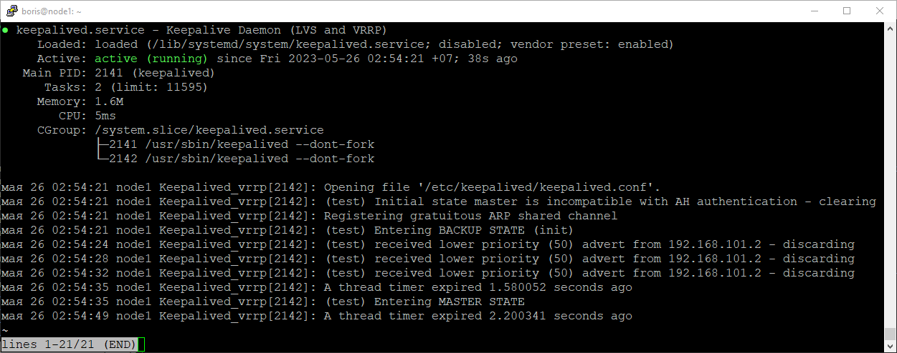
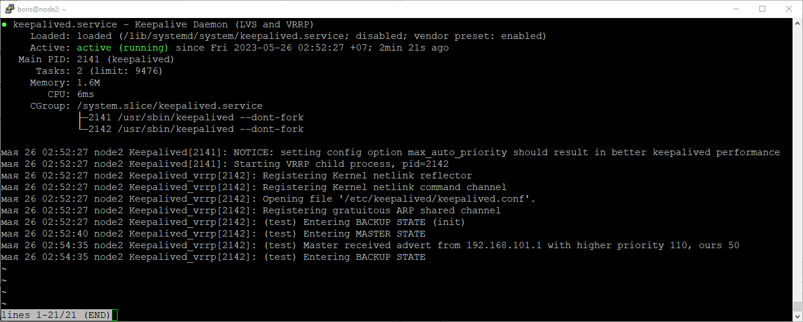

# Домашнее задание к занятию «`Keepalived/vrrp`» - `Борис Решетников`

### Задание 1

Разверните топологию из лекции и выполните установку и настройку сервиса Keepalived. 

```
vrrp_instance test {

state "name_mode"

interface "name_interface"

virtual_router_id "number id"

priority "number priority"

advert_int "number advert"

authentication {

auth_type "auth type"

auth_pass "password"

}

unicast_peer {

"ip address host"

}

virtual_ipaddress {

"ip address host" dev "interface" label "interface":vip

}

}

```

*В качестве решения предоставьте:*   
*- рабочую конфигурацию обеих нод, оформленную как блок кода в вашем md-файле;*   
*- скриншоты статуса сервисов, на которых видно, что одна нода перешла в MASTER, а вторая в BACKUP state.*   

### Ответ:

Конфигурационный файл /etc/keepalived/keepalived.conf для первой ноды:

```
vrrp_instance test {
state MASTER
interface enp0s9
virtual_router_id 11
priority 110
advert_int 5
authentication {
auth_type AH
auth_pass 1111
}
unicast_src_ip 192.168.102.1
unicast_peer {
192.168.102.2
}
virtual_ipaddress {
192.168.102.200 dev enp0s9 label enp0s9:vip
}
}

```

Конфигурационный файл /etc/keepalived/keepalived.conf для второй ноды:

```
vrrp_instance test {
state BACKUP
interface enp0s9
virtual_router_id 11
priority 50
advert_int 5
authentication {
auth_type AH
auth_pass 1111
}
unicast_src_ip 192.168.102.2
unicast_peer {
192.168.102.1
}
virtual_ipaddress {
192.168.102.200 dev enp0s9 label enp0s9:vip
}
}

```
Запускаем сервис keepalived на обеих нодах, выполнив команду sudo systemctl start keepalived. 

Статус сервиса keepalived для первой ноды:



Статус сервиса keepalived для второй ноды:



