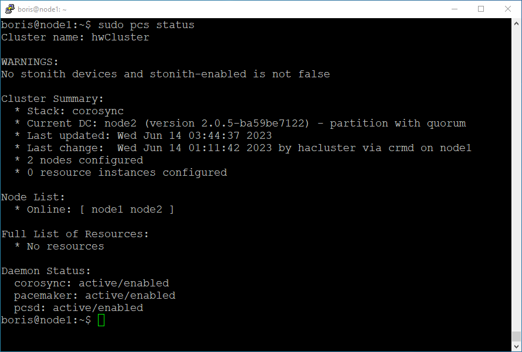
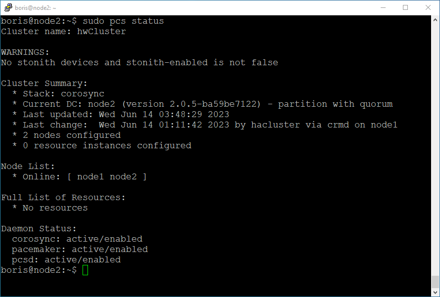

# Домашнее задание к занятию «`Pacemaker`» - `Борис Решетников`

### Задание 1

Опишите основные функции и назначение Pacemaker.

*Приведите ответ в свободной форме.*

### Ответ:

Peacemaker используется для построения отказоустойчивых кластеров. Основное назначение Pacemaker - достижение максимальной доступности управляемых им ресурсов и защита их от сбоев как на уровне самих ресурсов, так и на уровне целых узлов кластера. 
Основные функции Peacemaker:

* Обнаружение и восстановление сбоев на уровне узлов и сервисов.
* Независимость от подсистемы хранения: общий диск не требуется.
* Независимость от типов ресурсов: всё, что может быть заскриптовано, может быть кластеризировано.
* Поддержка STONITH (Shoot-The-Other-Node-In-The-Head). Это гарантирует, что предположительно отказавший сервер не будет мешать работе кластера, а именно не повредит данные разделяемых дисков.
* Поддержка кластеров любого размера.
* Поддержка и кворумных, и ресурсозависимых кластеров.
* Поддержка практически любой избыточной конфигурации.
* Автоматическая репликация конфига на все узлы кластера.
* Возможность задания порядка запуска ресурсов, а также их совместимости на одном узле.
* Поддержка расширенных типов ресурсов: клонов (запущен на множестве узлов) и с дополнительными состояниями (master/slave и т.п.)
* Единый кластерный шелл (crm), унифицированный, скриптующийся.

---

### Задание 2

Опишите основные функции и назначение Corosync.

*Приведите ответ в свободной форме.*

### Ответ:

Corosync предназначен для построения отказоустойчивых кластеров. Основное назначение Corosync - знать и передавать состояние всех участников кластера.
Основные функции:
* отслеживание состояния приложений;
* оповещение приложений о смене активной ноды кластера;
* отправка одинаковых сообщений процессам на всех узлах кластера;
* предоставление доступа к базе данных с конфигурацией и статистикой, а также отправка уведомлений о её изменениях.

---

### Задание 3

Соберите модель, состоящую из двух виртуальных машин. Установите Pacemaker, Corosync, Pcs. Настройте HA кластер.

*Пришлите скриншот рабочей конфигурации и состояния сервиса для каждого нода.*

### Ответ:

