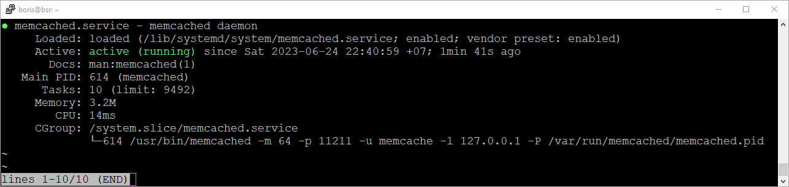
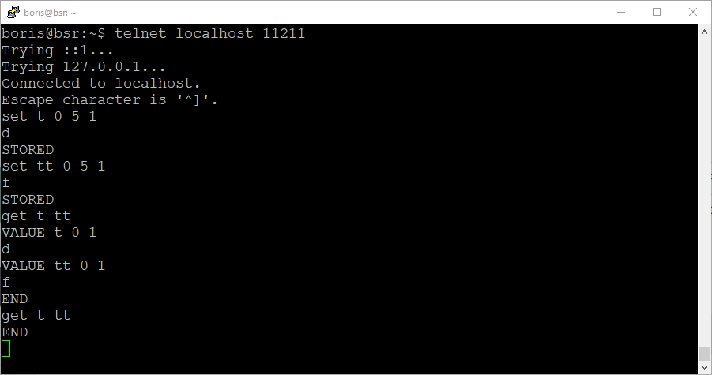
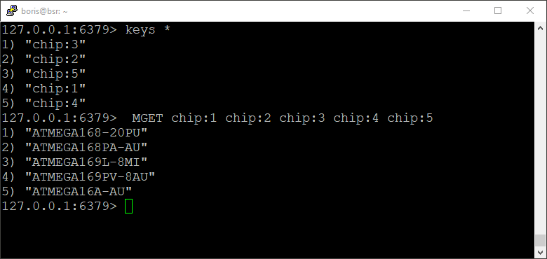

# Домашнее задание к занятию «`Кеширование Redis/memcached`» - `Борис Решетников`

### Задание 1. Кеширование 

Приведите примеры проблем, которые может решить кеширование. 

*Приведите ответ в свободной форме.*

### Ответ:
Кэширование позволяет решить проблему со скоростью доступа к данным, хранящимся на медленных накопителях. Если данные хранятся в удалённом хранилище, скорость доступа к которому ограничена интернет-каналом, то скорость доступа к базе данных может быть не достаточной. И это может затруднить работу с базой данных. И кэширование позволяет ускорить работу с часто используемыми неизменяемыми данными. Кэширование повышает производительность, увеличивает скорость ответа.
Кэширование позволяет обеспечить экономию ресурсов базы данных, например, применяя кэширование тяжёлых запросов.
Также кэширование может помочь в сглаживании бустов трафика. Например, во время чёрной пятницы интернет-магазины могут столкнуться с резким увеличеним трафика, и для решения этой проблемы могут использовать кэширование.

---

### Задание 2. Memcached

Установите и запустите memcached.

*Приведите скриншот systemctl status memcached, где будет видно, что memcached запущен.*

### Ответ:
Устанавливаем и запускаем memcached.
Скриншот systemctl status memcached:

---

### Задание 3. Удаление по TTL в Memcached

Запишите в memcached несколько ключей с любыми именами и значениями, для которых выставлен TTL 5. 

*Приведите скриншот, на котором видно, что спустя 5 секунд ключи удалились из базы.*

### Ответ:

---

### Задание 4. Запись данных в Redis

Запишите в Redis несколько ключей с любыми именами и значениями. 

*Через redis-cli достаньте все записанные ключи и значения из базы, приведите скриншот этой операции.*

### Ответ:

