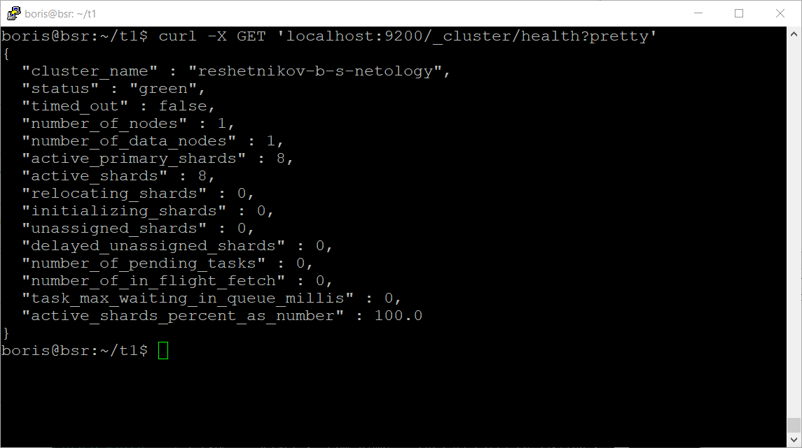
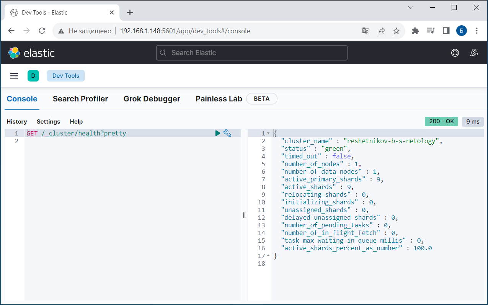
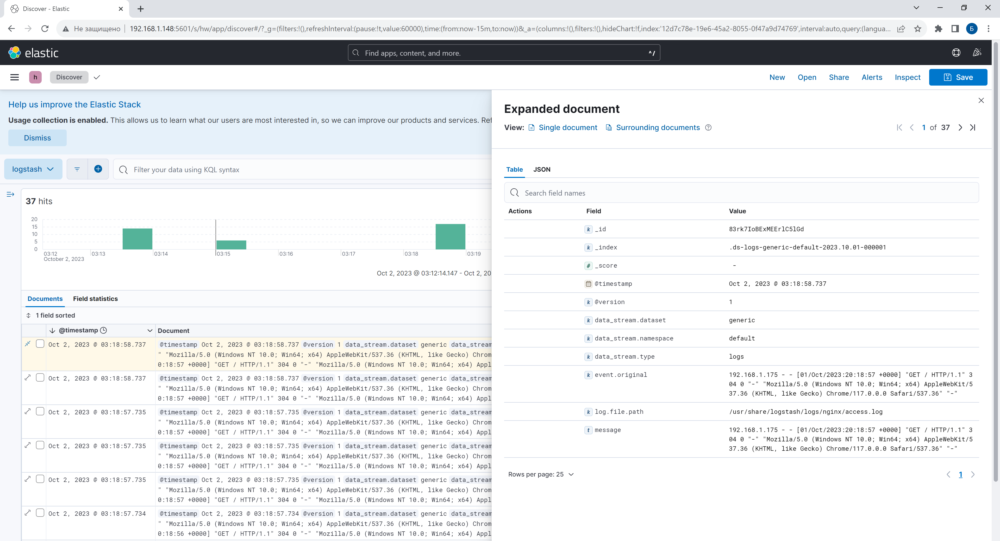
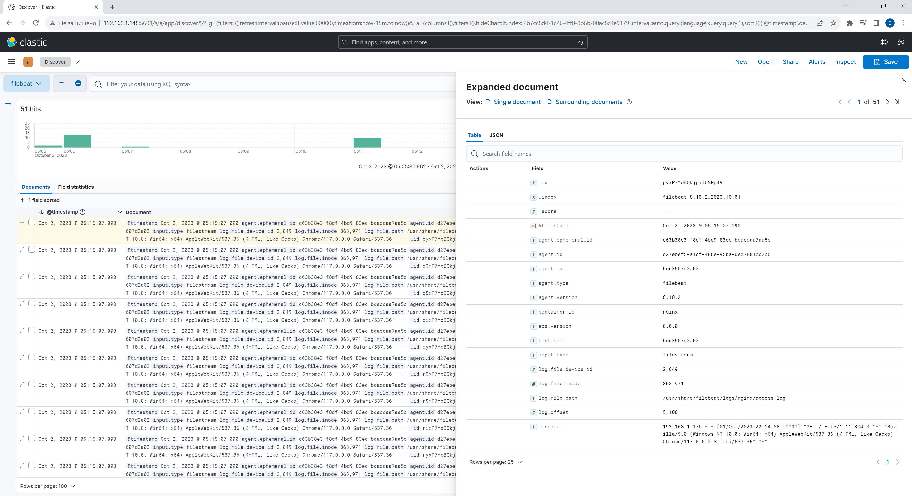

# Домашнее задание к занятию «`ELK`» - `Борис Решетников`

### Задание 1. Elasticsearch 

Установите и запустите Elasticsearch, после чего поменяйте параметр cluster_name на случайный. 

*Приведите скриншот команды 'curl -X GET 'localhost:9200/_cluster/health?pretty', сделанной на сервере с установленным Elasticsearch. Где будет виден нестандартный cluster_name*.

### Ответ:
При помощи Docker Compose был установлен и запущен Elasticsearch. 

Результат выполнения команды, сделанной на сервере с установленным Elasticsearch. Задан нестандартный cluster_name.
````
curl -X GET 'localhost:9200/_cluster/health?pretty
````


---

### Задание 2. Kibana

Установите и запустите Kibana.

*Приведите скриншот интерфейса Kibana на странице http://<ip вашего сервера>:5601/app/dev_tools#/console, где будет выполнен запрос GET /_cluster/health?pretty*.

### Ответ:

При помощи Docker Compose была установлен Kibana. Затем был выполнен запрос:
```
GET /_cluster/health?pretty
```


---

### Задание 3. Logstash

Установите и запустите Logstash и Nginx. С помощью Logstash отправьте access-лог Nginx в Elasticsearch. 

*Приведите скриншот интерфейса Kibana, на котором видны логи Nginx.*

### Ответ:

При помощи Docker Compose были установлены Logstash и Nginx. Была настроена отправка access-лог Nginx в Elasticsearch с помощью Logstash.

Скриншот интерфейса Kibana, где видны логи Nginx:



---

### Задание 4. Filebeat. 

Установите и запустите Filebeat. Переключите поставку логов Nginx с Logstash на Filebeat. 

*Приведите скриншот интерфейса Kibana, на котором видны логи Nginx, которые были отправлены через Filebeat.*

### Ответ:

При помощи Docker Compose был установлен Filebeat. Поставка логов Nginx была переключена с Logstash на Filebeat. 

Скриншот интерфейса Kibana, на котором видны логи Nginx, которые были отправлены через Filebeat:


