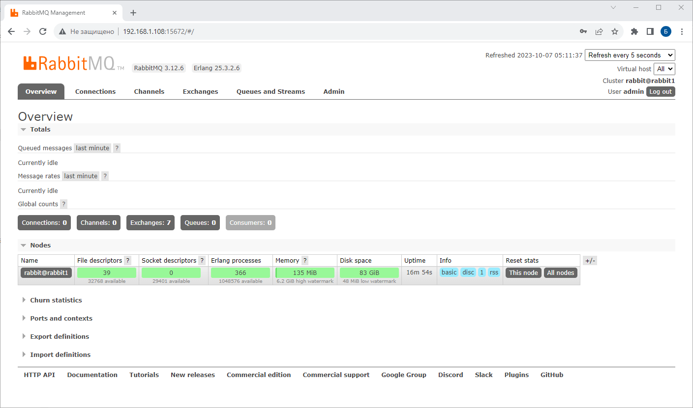
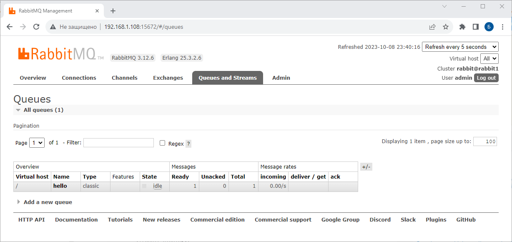
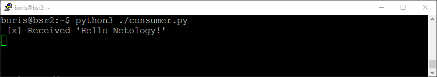
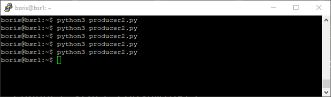
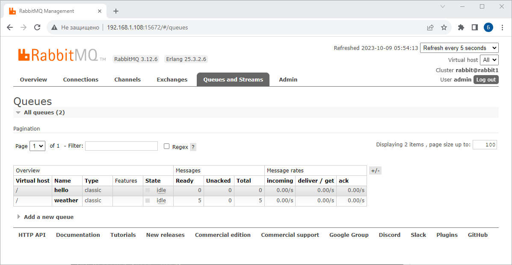
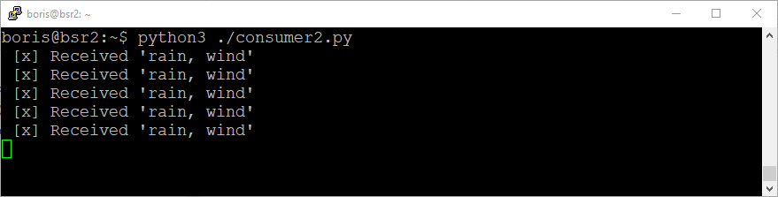

# Домашнее задание к занятию «`Очереди RabbitMQ`» - `Борис Решетников`

### Задание 1. Установка RabbitMQ

Используя Vagrant или VirtualBox, создайте виртуальную машину и установите RabbitMQ.
Добавьте management plug-in и зайдите в веб-интерфейс.

*Итогом выполнения домашнего задания будет приложенный скриншот веб-интерфейса RabbitMQ.*

### Ответ:

При помощи VirtualBox была создана виртуальная машина с операционной системой Ubuntu 20.04. 
Затем был установлен Erlang и RabbitMQ. 
Затем был включён веб-интерфейс RabbitMQ:
```
sudo rabbitmq-plugins enable rabbitmq_management
```
Скриншот веб-интерфейса RabbitMQ:



---

### Задание 2. Отправка и получение сообщений

Используя приложенные скрипты, проведите тестовую отправку и получение сообщения.
Для отправки сообщений необходимо запустить скрипт producer.py.

Для работы скриптов вам необходимо установить Python версии 3 и библиотеку Pika.
Также в скриптах нужно указать IP-адрес машины, на которой запущен RabbitMQ, заменив localhost на нужный IP.

```shell script
$ pip install pika
```

Зайдите в веб-интерфейс, найдите очередь под названием hello и сделайте скриншот.
После чего запустите второй скрипт consumer.py и сделайте скриншот результата выполнения скрипта

*В качестве решения домашнего задания приложите оба скриншота, сделанных на этапе выполнения.*

Для закрепления материала можете попробовать модифицировать скрипты, чтобы поменять название очереди и отправляемое сообщение.

### Ответ:
Создадим файл producer.py со скриптом:
```
#!/usr/bin/env python
# coding=utf-8
import pika

credentials = pika.PlainCredentials('admin', 'kukushka')
parameters = pika.ConnectionParameters('192.168.1.108', 5672, '/', credentials)
connection = pika.BlockingConnection(parameters)
channel = connection.channel()
channel.queue_declare(queue='hello')
channel.basic_publish(exchange='', routing_key='hello', body='Hello Netology!')
connection.close()
```
Далее создадим файл consumer.py со скриптом:
```
#!/usr/bin/env python
# coding=utf-8
import pika

credentials = pika.PlainCredentials('admin', 'kukushka')
parameters = pika.ConnectionParameters('192.168.1.108', 5672, '/', credentials)
connection = pika.BlockingConnection(parameters)
channel = connection.channel()
channel.queue_declare(queue='hello')
channel.basic_publish(exchange='', routing_key='hello', body='Hello Netology!')
connection.close()
```
Затем для проведения тестовой отправки запустим первый скрипт producer.py
```
python3 ./producer.py
```
Oчередь под названием hello представлена на скриншоте:



Затем для получения сообщения запустим второй скрипт consumer.py:
```
python3 ./consumer.py
```
Результат выполнения скрипта:


Далее модифицируем скрипты producer.py и consumer.py: изменим название очереди и текст сообщения.

producer2.py
```
#!/usr/bin/env python
# coding=utf-8
import pika

credentials = pika.PlainCredentials('admin', 'kukushka')
parameters = pika.ConnectionParameters('192.168.1.108', 5672, '/', credentials)
connection = pika.BlockingConnection(parameters)
channel = connection.channel()
channel.queue_declare(queue='weather')
channel.basic_publish(exchange='', routing_key='weather', body='rain, wind')
connection.close()
```
consumer2.py
```
#!/usr/bin/env python
# coding=utf-8
import pika

credentials = pika.PlainCredentials('admin', 'kukushka')
parameters = pika.ConnectionParameters('192.168.1.108', '5672', '/', credentials)
connection = pika.BlockingConnection(parameters)
channel = connection.channel()
channel.queue_declare(queue='weather')

def callback(ch, method, properties, body):
    print(" [x] Received %r" % body.decode())

channel.basic_consume(on_message_callback=callback, queue='weather', auto_ack=True)
channel.start_consuming()
```
Несколько раз выполним скрипт producer2.py.


Oчередь под названием "weather" представлена на скриншоте:


Затем для получений сообщений из очереди запустим второй скрипт consumer2.py:



---

### Задание 3. Подготовка HA кластера

Используя Vagrant или VirtualBox, создайте вторую виртуальную машину и установите RabbitMQ.
Добавьте в файл hosts название и IP-адрес каждой машины, чтобы машины могли видеть друг друга по имени.

Пример содержимого hosts файла:
```shell script
$ cat /etc/hosts
192.168.0.10 rmq01
192.168.0.11 rmq02
```
После этого ваши машины могут пинговаться по имени.

Затем объедините две машины в кластер и создайте политику ha-all на все очереди.

*В качестве решения домашнего задания приложите скриншоты из веб-интерфейса с информацией о доступных нодах в кластере и включённой политикой.*

Также приложите вывод команды с двух нод:

```shell script
$ rabbitmqctl cluster_status
```

Для закрепления материала снова запустите скрипт producer.py и приложите скриншот выполнения команды на каждой из нод:

```shell script
$ rabbitmqadmin get queue='hello'
```

После чего попробуйте отключить одну из нод, желательно ту, к которой подключались из скрипта, затем поправьте параметры подключения в скрипте consumer.py на вторую ноду и запустите его.

*Приложите скриншот результата работы второго скрипта.*

### Ответ:
