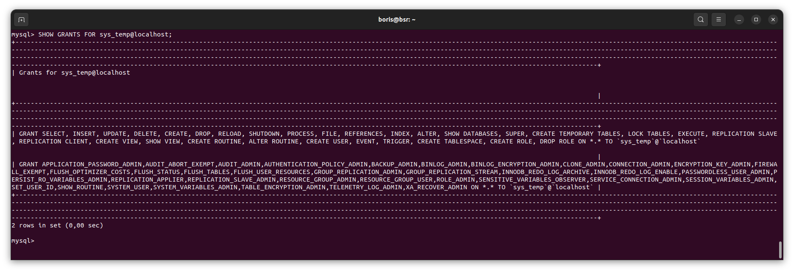

# Домашнее задание к занятию «`Работа с данными (DDL/DML)`» - `Борис Решетников`

Задание можно выполнить как в любом IDE, так и в командной строке.

### Задание 1
1.1. Поднимите чистый инстанс MySQL версии 8.0+. Можно использовать локальный сервер или контейнер Docker.

1.2. Создайте учётную запись sys_temp. 

1.3. Выполните запрос на получение списка пользователей в базе данных. (скриншот)

1.4. Дайте все права для пользователя sys_temp. 

1.5. Выполните запрос на получение списка прав для пользователя sys_temp. (скриншот)

1.6. Переподключитесь к базе данных от имени sys_temp.

1.6. По ссылке https://downloads.mysql.com/docs/sakila-db.zip скачайте дамп базы данных.

1.7. Восстановите дамп в базу данных.

1.8. При работе в IDE сформируйте ER-диаграмму получившейся базы данных. При работе в командной строке используйте команду для получения всех таблиц базы данных. (скриншот)

*Результатом работы должны быть скриншоты обозначенных заданий, а также простыня со всеми запросами.*

### Ответ:

1.1. Был поднят чистый инстанс MySQL версии 8.0.34 на виртуальной машине с операционной системой Ubuntu 22.04.

1.2. Далее из командной строки была создана учётная запись sys_temp. 

```
CREATE USER 'sys_temp'@'localhost' IDENTIFIED BY 'Passw0rd';
```
1.3. Далее был выполнен запрос на получение списка пользователей в базе данных.

```
SELECT user, host FROM mysql.user;
```


1.4. Далее были даны все права для пользователя sys_temp.

```
GRANT ALL PRIVILEGES ON *.* TO 'sys_temp'@'localhost';
```


1.5. Получен список прав для пользователя sys_temp:

```
SHOW GRANTS FOR sys_temp@localhost;
```



1.6. Затем было выполнено переподключение к базе данных от имени sys_temp.

```
mysql -h localhost -u sys_temp -p
```


1.7. Восстановление дампа в базу данных.
```

mysql> SOURCE ~/sakila-db/sakila-schema.sql;
mysql> SOURCE ~/sakila-db/sakila-data.sql;

```
1.8. Просмотр всех таблиц базы данных

```
mysql> USE sakila;
mysql> SHOW FULL TABLES;
```


При помощи DBeaver была получена ER-диаграмма:


---

### Задание 2

Составьте таблицу, используя любой текстовый редактор или Excel, в которой должно быть два столбца: в первом должны быть названия таблиц восстановленной базы, во втором названия первичных ключей этих таблиц. Пример: (скриншот/текст)

```
Название таблицы | Название первичного ключа
customer         | customer_id
```
### Ответ:
```
Название таблицы | Название первичного ключа
customer         | customer_id
address          | address_id
city             | city_id
country          | country_id
store            | store_id
staff            | staff_id
payment          | payment_id
rental           | rental_id
film             | film_id
film_category    | film_id, category_id
category         | category_id
language         | language_id
actor            | actor_id
film_actor       | actor_id, film_id
inventory        | inventory_id
film_text        | film_id
```