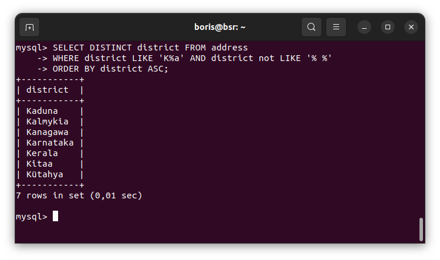
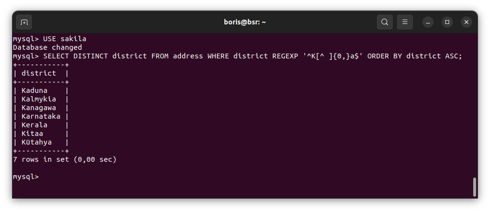
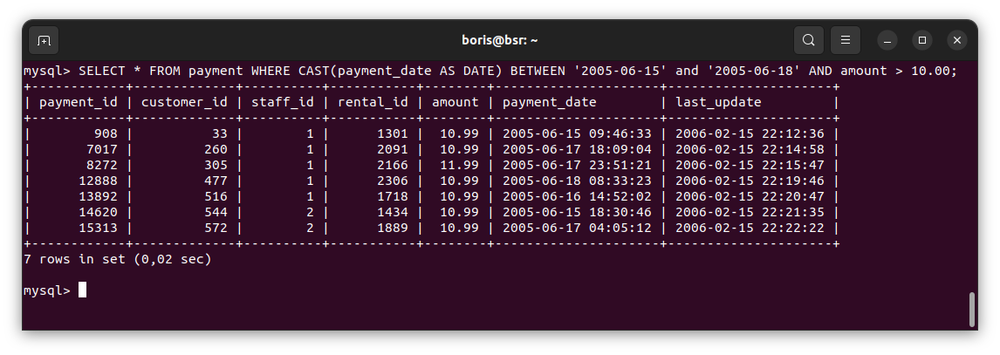
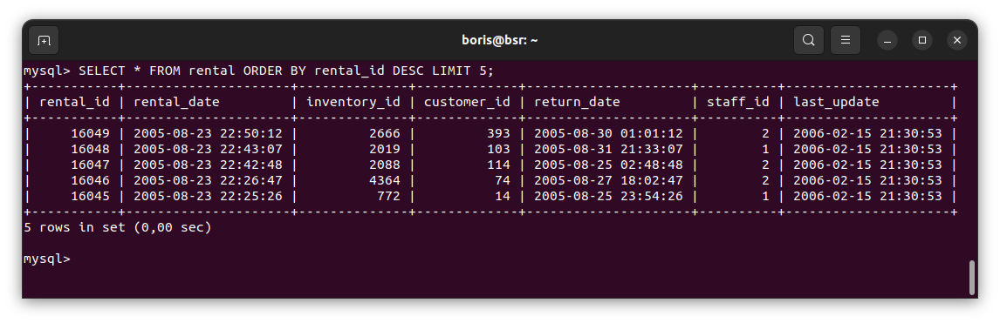
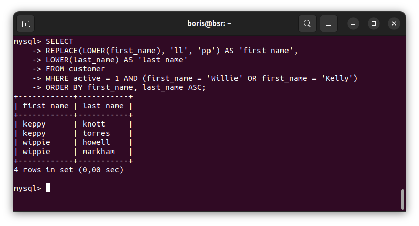
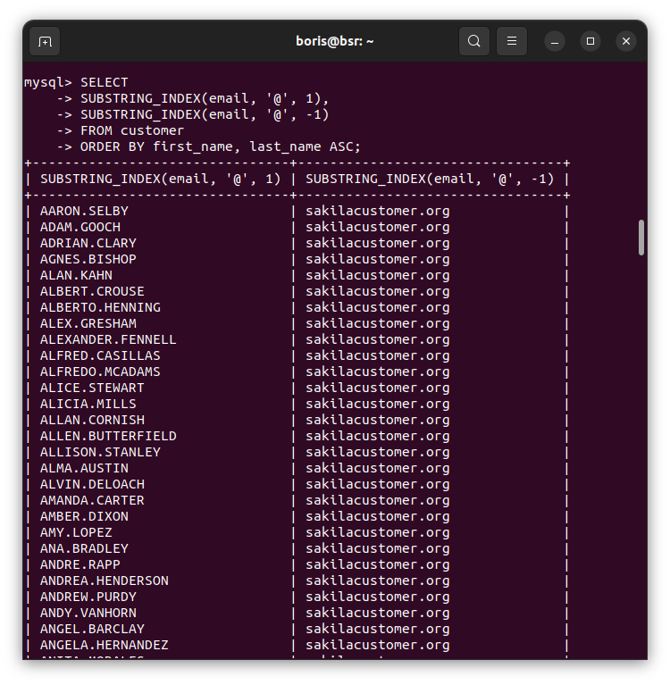

# Домашнее задание к занятию «`SQL. Часть 1`» - `Борис Решетников`

Задание можно выполнить как в любом IDE, так и в командной строке.

### Задание 1

Получите уникальные названия районов из таблицы с адресами, которые начинаются на “K” и заканчиваются на “a” и не содержат пробелов.

### Ответ:

```SQL
SELECT DISTINCT district FROM address WHERE district LIKE 'K%a' AND district not LIKE '% %' ORDER BY district ASC;
```


Другой вариант с использованием регулярного выражения:

```SQL
SELECT DISTINCT district FROM address WHERE district REGEXP '^K[^ ]{0,}a$' ORDER BY district ASC;
```


---

### Задание 2

Получите из таблицы платежей за прокат фильмов информацию по платежам, которые выполнялись в промежуток с 15 июня 2005 года по 18 июня 2005 года **включительно** и стоимость которых превышает 10.00.

### Ответ:

```SQL
SELECT * FROM payment WHERE CAST(payment_date AS DATE) BETWEEN '2005-06-15' AND '2005-06-18' AND amount > 10.00;
```



---

### Задание 3

Получите последние пять аренд фильмов.

### Ответ:

```SQL
SELECT * FROM rental ORDER BY id DESC LIMIT 5;

```


---

### Задание 4

Одним запросом получите активных покупателей, имена которых Kelly или Willie. 

Сформируйте вывод в результат таким образом:
- все буквы в фамилии и имени из верхнего регистра переведите в нижний регистр,
- замените буквы 'll' в именах на 'pp'.

### Ответ:

```SQL
SELECT 
REPLACE(LOWER(first_name), 'll', 'pp') AS 'first name', 
LOWER(last_name) AS 'last name'
FROM customer 
WHERE active = 1 AND (first_name = 'Willie' OR first_name = 'Kelly')
ORDER BY first_name, last_name ASC;

```


---

### Задание 5*

Выведите Email каждого покупателя, разделив значение Email на две отдельных колонки: в первой колонке должно быть значение, указанное до @, во второй — значение, указанное после @.

### Ответ:

```SQL
SELECT SUBSTRING_INDEX(email, '@', 1), SUBSTRING_INDEX(email, '@', -1) 
FROM customer
ORDER BY first_name, last_name ASC;
```

