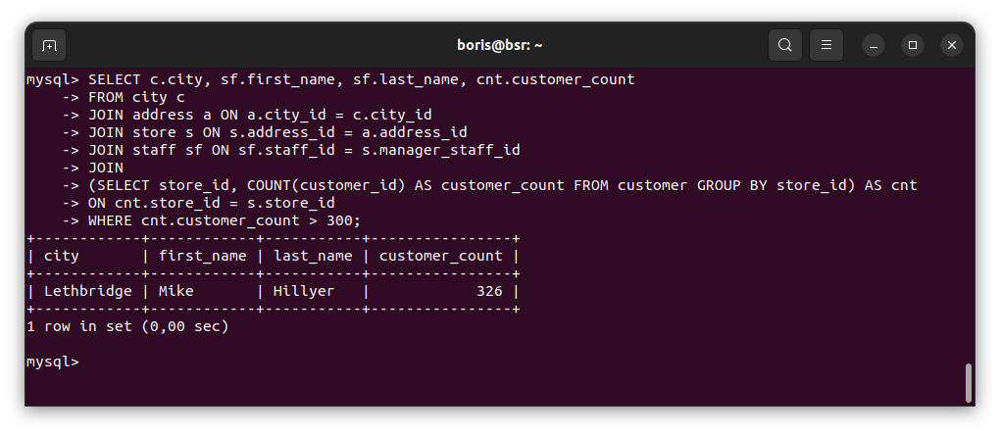
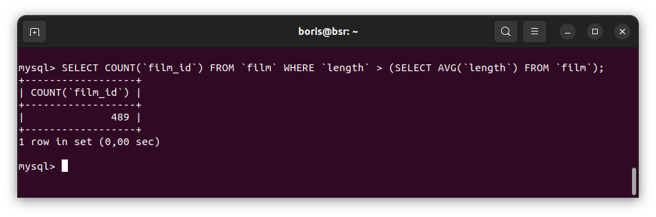

# Домашнее задание к занятию «`SQL. Часть 2`» - `Борис Решетников`

Задание можно выполнить как в любом IDE, так и в командной строке.

### Задание 1

Одним запросом получите информацию о магазине, в котором обслуживается более 300 покупателей, и выведите в результат следующую информацию: 
- фамилия и имя сотрудника из этого магазина;
- город нахождения магазина;
- количество пользователей, закреплённых в этом магазине.

### Ответ:

```SQL
SELECT c.city, sf.first_name, sf.last_name, cnt.customer_count 
FROM city c
JOIN address a ON a.city_id = c.city_id
JOIN store s ON s.address_id = a.address_id
JOIN staff sf ON sf.staff_id = s.manager_staff_id
JOIN 
(SELECT store_id, COUNT(customer_id) AS customer_count FROM customer GROUP BY store_id) AS cnt 
ON cnt.store_id = s.store_id
WHERE cnt.customer_count > 300;

```



---

### Задание 2

Получите количество фильмов, продолжительность которых больше средней продолжительности всех фильмов.

### Ответ:

```SQL
SELECT COUNT(`film_id`) FROM `film` WHERE `length` > (SELECT AVG(`length`) FROM `film`);
```



---

### Задание 3

Получите информацию, за какой месяц была получена наибольшая сумма платежей, и добавьте информацию по количеству аренд за этот месяц.

### Ответ:

---


## Дополнительные задания (со звёздочкой)
Эти задания дополнительные, то есть не обязательные к выполнению, и никак не повлияют на получение вами зачёта по этому домашнему заданию. Вы можете их выполнить, если хотите глубже шире разобраться в материале.

### Задание 4*

Посчитайте количество продаж, выполненных каждым продавцом. Добавьте вычисляемую колонку «Премия». Если количество продаж превышает 8000, то значение в колонке будет «Да», иначе должно быть значение «Нет».

### Ответ:

---

### Задание 5*

Найдите фильмы, которые ни разу не брали в аренду.

### Ответ:
