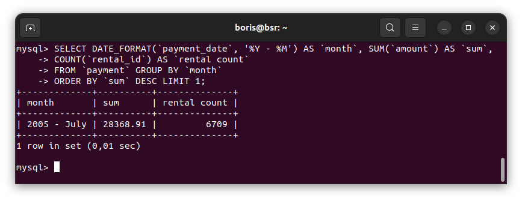
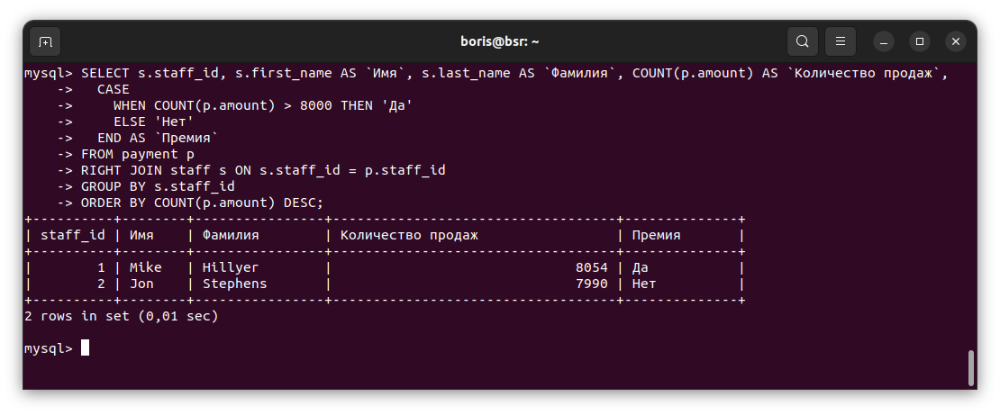
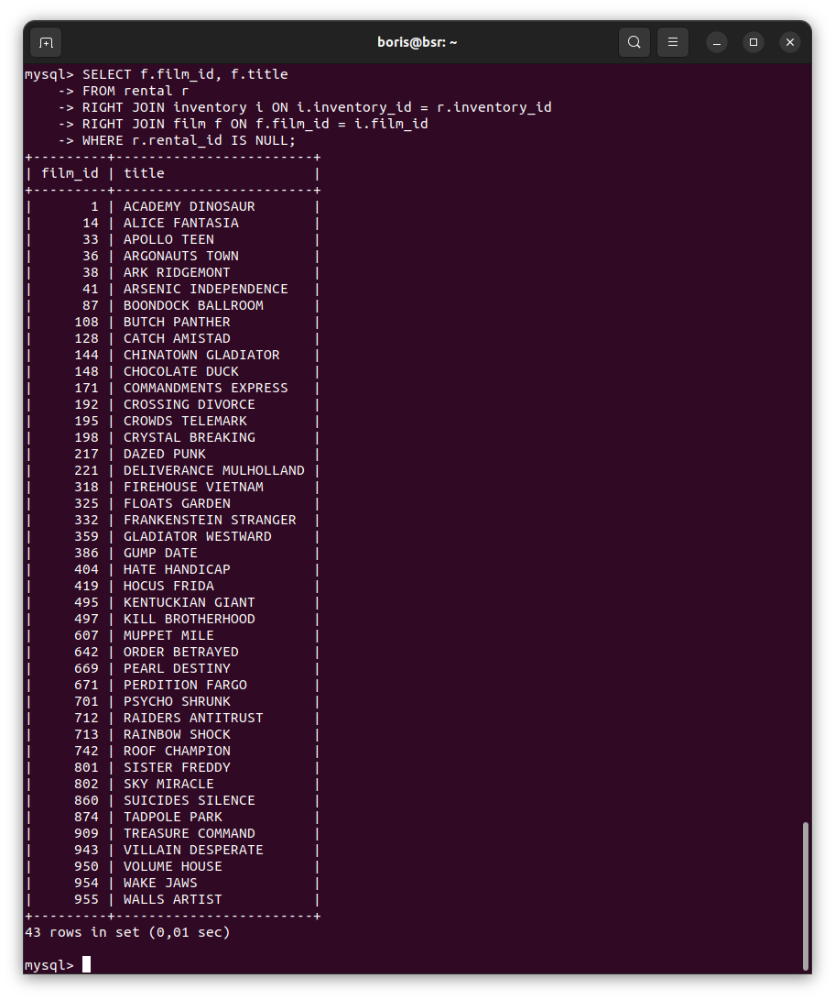
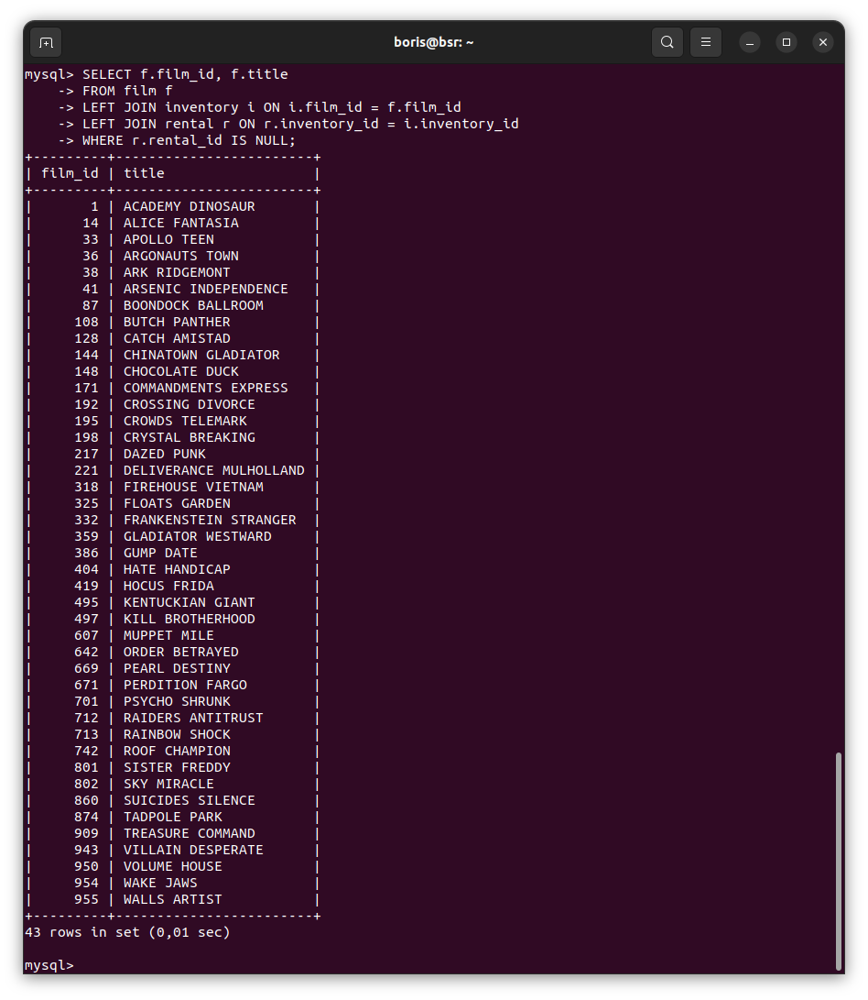

# Домашнее задание к занятию «`SQL. Часть 2`» - `Борис Решетников`

Задание можно выполнить как в любом IDE, так и в командной строке.

### Задание 1

Одним запросом получите информацию о магазине, в котором обслуживается более 300 покупателей, и выведите в результат следующую информацию: 
- фамилия и имя сотрудника из этого магазина;
- город нахождения магазина;
- количество пользователей, закреплённых в этом магазине.

### Ответ:

```SQL
SELECT c.city, sf.first_name, sf.last_name, cnt.customer_count 
FROM city c
JOIN address a ON a.city_id = c.city_id
JOIN store s ON s.address_id = a.address_id
JOIN staff sf ON sf.staff_id = s.manager_staff_id
JOIN 
(SELECT store_id, COUNT(customer_id) AS customer_count FROM customer GROUP BY store_id) AS cnt 
ON cnt.store_id = s.store_id
WHERE cnt.customer_count > 300;

```


---

### Задание 2

Получите количество фильмов, продолжительность которых больше средней продолжительности всех фильмов.

### Ответ:

```SQL
SELECT COUNT(`film_id`) FROM `film` WHERE `length` > (SELECT AVG(`length`) FROM `film`);
```


---

### Задание 3

Получите информацию, за какой месяц была получена наибольшая сумма платежей, и добавьте информацию по количеству аренд за этот месяц.

### Ответ:

```SQL
SELECT MONTHNAME(`payment_date`) AS `month`, SUM(`amount`) AS `sum`, 
COUNT(`rental_id`) AS `rental count`
FROM `payment` GROUP BY `month` ORDER BY `sum` DESC LIMIT 1;
```



---


## Дополнительные задания (со звёздочкой)
Эти задания дополнительные, то есть не обязательные к выполнению, и никак не повлияют на получение вами зачёта по этому домашнему заданию. Вы можете их выполнить, если хотите глубже шире разобраться в материале.

### Задание 4*

Посчитайте количество продаж, выполненных каждым продавцом. Добавьте вычисляемую колонку «Премия». Если количество продаж превышает 8000, то значение в колонке будет «Да», иначе должно быть значение «Нет».

### Ответ:

```SQL
SELECT s.staff_id, s.first_name AS `Имя`, s.last_name AS `Фамилия`, COUNT(p.amount) AS `Количество продаж`,
	CASE
		WHEN COUNT(p.amount) > 8000 THEN 'Да'
		ELSE 'Нет'
	END AS `Премия`
FROM payment p
RIGHT JOIN staff s ON s.staff_id = p.staff_id
GROUP BY s.staff_id
ORDER BY COUNT(p.amount) DESC;
```



---

### Задание 5*

Найдите фильмы, которые ни разу не брали в аренду.

### Ответ:

```
SELECT f.film_id, f.title
FROM rental r
RIGHT JOIN inventory i ON i.inventory_id = r.inventory_id
RIGHT JOIN film f ON f.film_id = i.film_id
WHERE r.rental_id IS NULL;
```
Другой вариант запроса:

```
SELECT f.film_id, f.title
FROM film f
LEFT JOIN inventory i ON i.film_id = f.film_id
LEFT JOIN rental r ON r.inventory_id = i.inventory_id
WHERE r.rental_id IS NULL;
```


