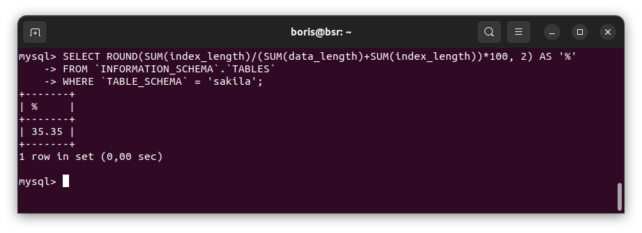

# Домашнее задание к занятию «`Индексы`» - `Борис Решетников`

### Задание 1

Напишите запрос к учебной базе данных, который вернёт процентное отношение общего размера всех индексов к общему размеру всех таблиц.

### Ответ:

```SQL
SELECT ROUND(SUM(index_length)/(SUM(data_length)+SUM(index_length))*100, 2) AS '%' 
FROM `INFORMATION_SCHEMA`.`TABLES` 
WHERE `TABLE_SCHEMA` = 'sakila';
```
Процентное отношение общего размера всех индексов к общему размеру всех таблиц


### Задание 2

Выполните explain analyze следующего запроса:
```sql
select distinct concat(c.last_name, ' ', c.first_name), sum(p.amount) over (partition by c.customer_id, f.title)
from payment p, rental r, customer c, inventory i, film f
where date(p.payment_date) = '2005-07-30' and p.payment_date = r.rental_date and r.customer_id = c.customer_id and i.inventory_id = r.inventory_id
```
- перечислите узкие места;
- оптимизируйте запрос: внесите корректировки по использованию операторов, при необходимости добавьте индексы.

### Ответ:

Выполним explain analyze:

```sql
EXPLAIN ANALYZE
select distinct concat(c.last_name, ' ', c.first_name), 
sum(p.amount) over (partition by c.customer_id, f.title)
from payment p, rental r, customer c, inventory i, film f
where date(p.payment_date) = '2005-07-30' and p.payment_date = r.rental_date
and r.customer_id = c.customer_id and i.inventory_id = r.inventory_id;
```
```
EXPLAIN
"-> Table scan on <temporary>  (cost=2.5..2.5 rows=0) (actual time=6506..6506 rows=391 loops=1)
    -> Temporary table with deduplication  (cost=0..0 rows=0) (actual time=6506..6506 rows=391 loops=1)
        -> Window aggregate with buffering: sum(payment.amount) OVER (PARTITION BY c.customer_id,f.title )   (actual time=2840..6281 rows=642000 loops=1)
            -> Sort: c.customer_id, f.title  (actual time=2840..2952 rows=642000 loops=1)
                -> Stream results  (cost=21.1e+6 rows=15.6e+6) (actual time=0.402..1922 rows=642000 loops=1)
                    -> Nested loop inner join  (cost=21.1e+6 rows=15.6e+6) (actual time=0.396..1600 rows=642000 loops=1)
                        -> Nested loop inner join  (cost=19.6e+6 rows=15.6e+6) (actual time=0.392..1343 rows=642000 loops=1)
                            -> Nested loop inner join  (cost=18e+6 rows=15.6e+6) (actual time=0.385..1075 rows=642000 loops=1)
                                -> Inner hash join (no condition)  (cost=1.54e+6 rows=15.4e+6) (actual time=0.37..75 rows=634000 loops=1)
                                    -> Filter: (cast(p.payment_date as date) = '2005-07-30')  (cost=1.61 rows=15400) (actual time=0.0365..9.53 rows=634 loops=1)
                                        -> Table scan on p  (cost=1.61 rows=15400) (actual time=0.0235..5.71 rows=16044 loops=1)
                                    -> Hash
                                        -> Covering index scan on f using idx_title  (cost=103 rows=1000) (actual time=0.0447..0.242 rows=1000 loops=1)
                                -> Covering index lookup on r using rental_date (rental_date=p.payment_date)  (cost=0.969 rows=1.01) (actual time=963e-6..0.00137 rows=1.01 loops=634000)
                            -> Single-row index lookup on c using PRIMARY (customer_id=r.customer_id)  (cost=250e-6 rows=1) (actual time=174e-6..208e-6 rows=1 loops=642000)
                        -> Single-row covering index lookup on i using PRIMARY (inventory_id=r.inventory_id)  (cost=250e-6 rows=1) (actual time=155e-6..189e-6 rows=1 loops=642000)
"
```
Запрос выполняется 6506 миллисекунд.

Узкие места
1) Таблица customer связывается с таблицей payment не напрямую, а через другую таблицу rental. 

2) Таблица rental соединяется с таблицей payment через атрибуты rental.rantal_data и payment.payment_data. Эти атрибуты не являтся ни первичными, ни внешними ключами. Таблицу rental и таблицу payment нужно связывать через атрибуты rental.rental_id (первичный ключ) и payment.rental_id (внешний ключ).

3) Не указаны условия присоединения таблицы film с другими таблицами. Из-за этого каждая строка таблицы film, в которой 1000 строк, сопоставляется с каждой строкой соединённых таблиц customer, rental, payment (Декартово произведение). Это значительно увеличивает время запроса.

4) Если применить оконную функцию таким образом: 
```
sum(p.amount) over (partition by c.customer_id) 
```
то, данные суммируются для одинаковых значений атрибута c.customer_id, но из-за многих дублированных строк подсчёт неправильный. Чтобы получить 
правильный результат оконная функнция выполняется и для атрибута f.title: 
```
sum(p.amount) over (partition by c.customer_id, f.title)
```
Таким образом получается правильный результат. Но выполнение оконной функция для такого большого количества строк занимает много времени.

Теперь выполним оптимизацию SQL-запроса.

Перепишим исходный SQL запрос с использованием оператора JOIN:

```SQL
EXPLAIN ANALYZE
select DISTINCT concat(c.last_name, ' ', c.first_name) AS name,
sum(p.amount) over (partition by c.customer_id, f.title) AS 'sum'
FROM customer c
JOIN rental r ON r.customer_id = c.customer_id
JOIN payment p ON p.payment_date = r.rental_date
JOIN inventory i ON i.inventory_id = r.inventory_id,
film f
where date(p.payment_date) = '2005-07-30';
```
```
-> Limit: 200 row(s)  (cost=0..0 rows=0) (actual time=4922..4922 rows=200 loops=1)
    -> Table scan on <temporary>  (cost=2.5..2.5 rows=0) (actual time=4922..4922 rows=200 loops=1)
        -> Temporary table with deduplication  (cost=0..0 rows=0) (actual time=4922..4922 rows=391 loops=1)
            -> Window aggregate with buffering: sum(payment.amount) OVER (PARTITION BY c.customer_id,f.title )   (actual time=2225..4756 rows=642000 loops=1)
                -> Sort: c.customer_id, f.title  (actual time=2225..2308 rows=642000 loops=1)
                    -> Stream results  (cost=10.1e+6 rows=15.6e+6) (actual time=0.291..1534 rows=642000 loops=1)
                        -> Nested loop inner join  (cost=10.1e+6 rows=15.6e+6) (actual time=0.287..1271 rows=642000 loops=1)
                            -> Nested loop inner join  (cost=8.51e+6 rows=15.6e+6) (actual time=0.284..1050 rows=642000 loops=1)
                                -> Nested loop inner join  (cost=6.95e+6 rows=15.6e+6) (actual time=0.28..824 rows=642000 loops=1)
                                    -> Inner hash join (no condition)  (cost=1.54e+6 rows=15.4e+6) (actual time=0.27..56.5 rows=634000 loops=1)
                                        -> Filter: (cast(p.payment_date as date) = '2005-07-30')  (cost=1.61 rows=15400) (actual time=0.0282..6.23 rows=634 loops=1)
                                            -> Table scan on p  (cost=1.61 rows=15400) (actual time=0.0175..3.75 rows=16044 loops=1)
                                        -> Hash
                                            -> Covering index scan on f using idx_title  (cost=103 rows=1000) (actual time=0.0249..0.174 rows=1000 loops=1)
                                    -> Covering index lookup on r using rental_date (rental_date=p.payment_date)  (cost=0.25 rows=1.01) (actual time=729e-6..0.00103 rows=1.01 loops=634000)
                                -> Single-row index lookup on c using PRIMARY (customer_id=r.customer_id)  (cost=250e-6 rows=1) (actual time=140e-6..170e-6 rows=1 loops=642000)
                            -> Single-row covering index lookup on i using PRIMARY (inventory_id=r.inventory_id)  (cost=250e-6 rows=1) (actual time=134e-6..163e-6 rows=1 loops=642000)

```

Выполним присоединение таблицы film к таблице inventory по атрибутам f.film_id (первичный ключ)и i.film_id (внешний ключ). Оконная функция выполняется теперь только для атрибута c.customer_id:

```SQL
EXPLAIN ANALYZE
select DISTINCT concat(c.last_name, ' ', c.first_name) AS name,
sum(p.amount) over (partition by c.customer_id) AS 'sum'
FROM customer c
JOIN rental r ON r.customer_id = c.customer_id
JOIN payment p ON p.payment_date = r.rental_date
JOIN inventory i ON i.inventory_id = r.inventory_id
JOIN film f ON f.film_id = i.film_id
where date(p.payment_date) = '2005-07-30';
```

```
-> Limit: 200 row(s)  (cost=0..0 rows=0) (actual time=9.97..10 rows=200 loops=1)
    -> Table scan on <temporary>  (cost=2.5..2.5 rows=0) (actual time=9.97..9.99 rows=200 loops=1)
        -> Temporary table with deduplication  (cost=0..0 rows=0) (actual time=9.97..9.97 rows=391 loops=1)
            -> Window aggregate with buffering: sum(payment.amount) OVER (PARTITION BY c.customer_id )   (actual time=8.89..9.83 rows=642 loops=1)
                -> Sort: c.customer_id  (actual time=8.88..8.93 rows=642 loops=1)
                    -> Stream results  (cost=23340 rows=15588) (actual time=0.0711..8.75 rows=642 loops=1)
                        -> Nested loop inner join  (cost=23340 rows=15588) (actual time=0.0677..8.5 rows=642 loops=1)
                            -> Nested loop inner join  (cost=17885 rows=15588) (actual time=0.0643..7.82 rows=642 loops=1)
                                -> Nested loop inner join  (cost=12429 rows=15588) (actual time=0.0606..7.06 rows=642 loops=1)
                                    -> Nested loop inner join  (cost=6973 rows=15588) (actual time=0.0558..6.53 rows=642 loops=1)
                                        -> Filter: (cast(p.payment_date as date) = '2005-07-30')  (cost=1564 rows=15400) (actual time=0.045..5.57 rows=634 loops=1)
                                            -> Table scan on p  (cost=1564 rows=15400) (actual time=0.0316..3.39 rows=16044 loops=1)
                                        -> Covering index lookup on r using rental_date (rental_date=p.payment_date)  (cost=0.25 rows=1.01) (actual time=959e-6..0.00133 rows=1.01 loops=634)
                                    -> Single-row index lookup on c using PRIMARY (customer_id=r.customer_id)  (cost=0.25 rows=1) (actual time=613e-6..642e-6 rows=1 loops=642)
                                -> Single-row index lookup on i using PRIMARY (inventory_id=r.inventory_id)  (cost=0.25 rows=1) (actual time=882e-6..912e-6 rows=1 loops=642)
                            -> Single-row covering index lookup on f using PRIMARY (film_id=i.film_id)  (cost=0.25 rows=1) (actual time=849e-6..878e-6 rows=1 loops=642)

```

Таблицы film и rental теперь не нужны, их не нужно присоединять. 
```SQL
EXPLAIN ANALYZE
select DISTINCT concat(c.last_name, ' ', c.first_name) AS name,
sum(p.amount) over (partition by c.customer_id) 'sum'
FROM customer c
JOIN rental r ON r.customer_id = c.customer_id
JOIN payment p ON p.payment_date = r.rental_date
where date(p.payment_date) = '2005-07-30';
```
```
-> Limit: 200 row(s)  (cost=0..0 rows=0) (actual time=8.63..8.67 rows=200 loops=1)
    -> Table scan on <temporary>  (cost=2.5..2.5 rows=0) (actual time=8.63..8.66 rows=200 loops=1)
        -> Temporary table with deduplication  (cost=0..0 rows=0) (actual time=8.63..8.63 rows=391 loops=1)
            -> Window aggregate with buffering: sum(payment.amount) OVER (PARTITION BY c.customer_id )   (actual time=7.5..8.5 rows=642 loops=1)
                -> Sort: c.customer_id  (actual time=7.48..7.53 rows=642 loops=1)
                    -> Stream results  (cost=12429 rows=15588) (actual time=0.056..7.35 rows=642 loops=1)
                        -> Nested loop inner join  (cost=12429 rows=15588) (actual time=0.0531..7.13 rows=642 loops=1)
                            -> Nested loop inner join  (cost=6973 rows=15588) (actual time=0.0487..6.58 rows=642 loops=1)
                                -> Filter: (cast(p.payment_date as date) = '2005-07-30')  (cost=1564 rows=15400) (actual time=0.0385..5.66 rows=634 loops=1)
                                    -> Table scan on p  (cost=1564 rows=15400) (actual time=0.0277..3.43 rows=16044 loops=1)
                                -> Covering index lookup on r using rental_date (rental_date=p.payment_date)  (cost=0.25 rows=1.01) (actual time=939e-6..0.00125 rows=1.01 loops=634)
                            -> Single-row index lookup on c using PRIMARY (customer_id=r.customer_id)  (cost=0.25 rows=1) (actual time=631e-6..661e-6 rows=1 loops=642)

```

Таблицу rental и таблицу payment свяжeм через атрибуты rental.rental_id (первичный ключ) и payment.rental_id (внешний ключ):

```SQL
EXPLAIN ANALYZE
select DISTINCT concat(c.last_name, ' ', c.first_name) AS name,
sum(p.amount) over (partition by c.customer_id) AS 'sum'
FROM customer c
JOIN rental r ON r.customer_id = c.customer_id
JOIN payment p ON p.rental_id = r.rental_id
where date(p.payment_date) = '2005-07-30';
```
```
-> Limit: 200 row(s)  (cost=0..0 rows=0) (actual time=42.8..42.8 rows=200 loops=1)
    -> Table scan on <temporary>  (cost=2.5..2.5 rows=0) (actual time=42.8..42.8 rows=200 loops=1)
        -> Temporary table with deduplication  (cost=0..0 rows=0) (actual time=42.8..42.8 rows=391 loops=1)
            -> Window aggregate with buffering: sum(payment.amount) OVER (PARTITION BY c.customer_id )   (actual time=41.7..42.6 rows=634 loops=1)
                -> Sort: c.customer_id  (actual time=41.6..41.7 rows=634 loops=1)
                    -> Stream results  (cost=12903 rows=16008) (actual time=0.194..41.5 rows=634 loops=1)
                        -> Nested loop inner join  (cost=12903 rows=16008) (actual time=0.19..41.2 rows=634 loops=1)
                            -> Nested loop inner join  (cost=7301 rows=16008) (actual time=0.0394..8.77 rows=16044 loops=1)
                                -> Covering index scan on r using idx_fk_customer_id  (cost=1698 rows=16008) (actual time=0.0312..2.95 rows=16044 loops=1)
                                -> Single-row index lookup on c using PRIMARY (customer_id=r.customer_id)  (cost=0.25 rows=1) (actual time=154e-6..184e-6 rows=1 loops=16044)
                            -> Filter: (cast(p.payment_date as date) = '2005-07-30')  (cost=0.25 rows=1) (actual time=0.00185..0.00186 rows=0.0395 loops=16044)
                                -> Index lookup on p using fk_payment_rental (rental_id=r.rental_id)  (cost=0.25 rows=1) (actual time=0.00134..0.00157 rows=1 loops=16044)

```

Таблицу payment присоединим к таблице customer напрямую по атрибутам customer.customer_id (первичный ключ) и payment.customer_id (вторичный ключ)

```SQL
EXPLAIN ANALYZE
select DISTINCT concat(c.last_name, ' ', c.first_name) AS name,
sum(p.amount) over (partition by c.customer_id) AS 'sum'
FROM customer c
JOIN payment p ON p.customer_id = c.customer_id
where date(p.payment_date) = '2005-07-30';
```
```
-> Limit: 200 row(s)  (cost=0..0 rows=0) (actual time=8.8..8.86 rows=200 loops=1)
    -> Table scan on <temporary>  (cost=2.5..2.5 rows=0) (actual time=8.8..8.83 rows=200 loops=1)
        -> Temporary table with deduplication  (cost=0..0 rows=0) (actual time=8.8..8.8 rows=391 loops=1)
            -> Window aggregate with buffering: sum(payment.amount) OVER (PARTITION BY c.customer_id )   (actual time=7.49..8.63 rows=634 loops=1)
                -> Sort: c.customer_id  (actual time=7.47..7.53 rows=634 loops=1)
                    -> Stream results  (cost=6954 rows=15400) (actual time=0.0909..7.32 rows=634 loops=1)
                        -> Nested loop inner join  (cost=6954 rows=15400) (actual time=0.0854..7.09 rows=634 loops=1)
                            -> Filter: (cast(p.payment_date as date) = '2005-07-30')  (cost=1564 rows=15400) (actual time=0.0486..6.45 rows=634 loops=1)
                                -> Table scan on p  (cost=1564 rows=15400) (actual time=0.0361..4.12 rows=16044 loops=1)
                            -> Single-row index lookup on c using PRIMARY (customer_id=p.customer_id)  (cost=0.25 rows=1) (actual time=773e-6..805e-6 rows=1 loops=634)

```

Оконную функцию можно заменить на GROUP BY

```SQL
EXPLAIN ANALYZE
SELECT CONCAT(c.last_name, ' ', c.first_name) AS name, SUM(p.amount) AS 'sum' 
FROM customer c
JOIN payment p ON p.customer_id = c.customer_id
WHERE date(p.payment_date) = '2005-07-30'
GROUP BY name
```
```
-> Limit: 200 row(s)  (actual time=18.3..18.4 rows=200 loops=1)
    -> Table scan on <temporary>  (actual time=18.3..18.4 rows=200 loops=1)
        -> Aggregate using temporary table  (actual time=18.3..18.3 rows=391 loops=1)
            -> Nested loop inner join  (cost=5451 rows=15400) (actual time=0.129..17.6 rows=634 loops=1)
                -> Table scan on c  (cost=61.2 rows=599) (actual time=0.0509..0.304 rows=599 loops=1)
                -> Filter: (cast(p.payment_date as date) = '2005-07-30')  (cost=6.43 rows=25.7) (actual time=0.0251..0.0285 rows=1.06 loops=599)
                    -> Index lookup on p using idx_fk_customer_id (customer_id=c.customer_id)  (cost=6.43 rows=25.7) (actual time=0.0197..0.0238 rows=26.8 loops=599)

```

Создадим индекс:

```SQL
CREATE INDEX payment_date ON payment(payment_date);
```

Выполним запрос:
```SQL
EXPLAIN ANALYZE
SELECT CONCAT(c.last_name, ' ', c.first_name) AS name, SUM(p.amount) AS 'sum' 
FROM customer c
JOIN payment p ON p.customer_id = c.customer_id
WHERE p.payment_date BETWEEN '2005-07-30 00:00:00' AND '2005-07-30 23:59:59'
GROUP BY name
ORDER BY name, sum
```
```
-> Limit: 200 row(s)  (actual time=2.32..2.34 rows=200 loops=1)
    -> Sort: name, sum, limit input to 200 row(s) per chunk  (actual time=2.32..2.33 rows=200 loops=1)
        -> Table scan on <temporary>  (actual time=2.1..2.16 rows=391 loops=1)
            -> Aggregate using temporary table  (actual time=2.1..2.1 rows=391 loops=1)
                -> Nested loop inner join  (cost=507 rows=634) (actual time=0.0244..1.61 rows=634 loops=1)
                    -> Index range scan on p using p_date over ('2005-07-30 00:00:00' <= payment_date <= '2005-07-30 23:59:59'), with index condition: (p.payment_date between '2005-07-30 00:00:00' and '2005-07-30 23:59:59')  (cost=286 rows=634) (actual time=0.0187..0.951 rows=634 loops=1)
                    -> Single-row index lookup on c using PRIMARY (customer_id=p.customer_id)  (cost=0.25 rows=1) (actual time=838e-6..866e-6 rows=1 loops=634)

```
Фактическое время выполнения запроса снизилось с 6506 миллисекунд до 2,34 миллисекунд.