# Домашнее задание к занятию «`Базы данных в облаке`» - `Борис Решетников`

### Задание 1.

#### Создание кластера
1. Перейдите на главную страницу сервиса Managed Service for PostgreSQL.
1. Создайте кластер PostgreSQL со следующими параметрами:
- класс хоста: s2.micro, диск network-ssd любого размера;
- хосты: нужно создать два хоста в двух разных зонах доступности и указать необходимость публичного доступа, то есть публичного IP адреса, для них;
- установите учётную запись для пользователя и базы.

Остальные параметры оставьте по умолчанию либо измените по своему усмотрению.

* Нажмите кнопку «Создать кластер» и дождитесь окончания процесса создания, статус кластера = RUNNING. Кластер создаётся от 5 до 10 минут.

#### Подключение к мастеру и реплике 

* Используйте инструкцию по подключению к кластеру, доступную на вкладке «Обзор»: cкачайте SSL-сертификат и подключитесь к кластеру с помощью утилиты psql, указав hostname всех узлов и атрибут ```target_session_attrs=read-write```.

* Проверьте, что подключение прошло к master-узлу.
```
select case when pg_is_in_recovery() then 'REPLICA' else 'MASTER' end;
```
* Посмотрите количество подключенных реплик:
```
select count(*) from pg_stat_replication;
```

### Проверьте работоспособность репликации в кластере

* Создайте таблицу и вставьте одну-две строки.
```
CREATE TABLE test_table(text varchar);
```
```
insert into test_table values('Строка 1');
```

* Выйдите из psql командой ```\q```.

* Теперь подключитесь к узлу-реплике. Для этого из команды подключения удалите атрибут ```target_session_attrs```  и в параметре атрибут ```host``` передайте только имя хоста-реплики. Роли хостов можно посмотреть на соответствующей вкладке UI консоли.

* Проверьте, что подключение прошло к узлу-реплике.
```
select case when pg_is_in_recovery() then 'REPLICA' else 'MASTER' end;
```
* Проверьте состояние репликации
```
select status from pg_stat_wal_receiver;
```

* Для проверки, что механизм репликации данных работает между зонами доступности облака, выполните запрос к таблице, созданной на предыдущем шаге:
```
select * from test_table;
```

*В качестве результата вашей работы пришлите скриншоты:*

*1) Созданной базы данных;*
*2) Результата вывода команды на реплике ```select * from test_table;```.*

### Ответ:

##### 1. Был создан кластер PostgreSQL с параметрами: 
- класс хоста: s2.micro (2 vCPU, 100% vCPU rate, 8 ГБ RAM)
- диск network-ssd 10 ГБ
- созданы 2 хоста в зонах доступности ru-central1-a и ru-central1-b. Для обоих хостов есть публичный доступ.
- создана база данных db1
- создан пользователь user1

###### Скриншот списка кластеров:
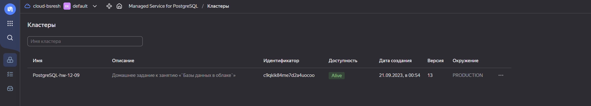

###### Скриншот характеристик созданного кластера:
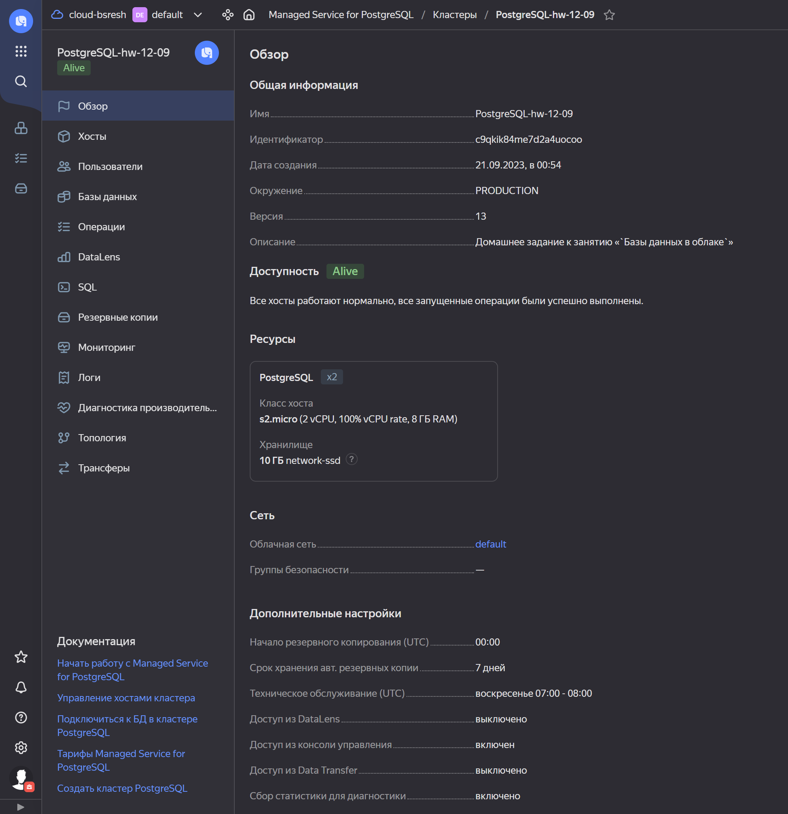

###### Скриншот списка хостов созданного кластера:
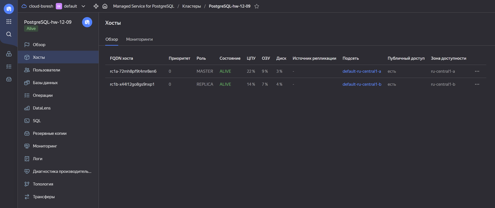

###### Скриншот списка пользователей:
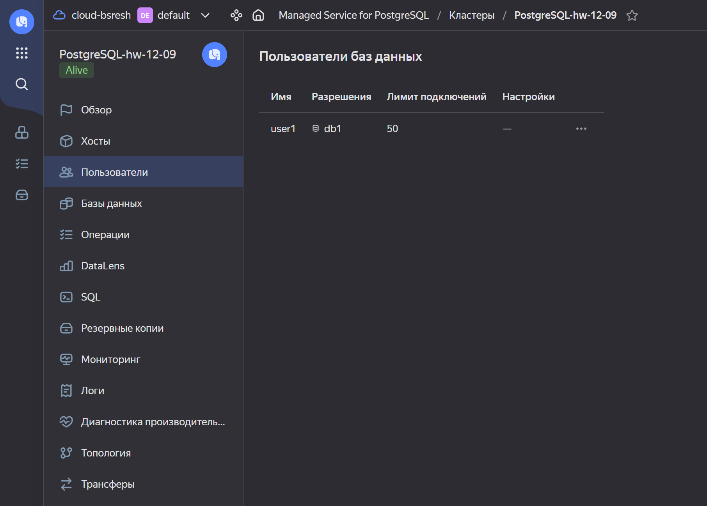

###### Скриншот списка баз данных в кластере:
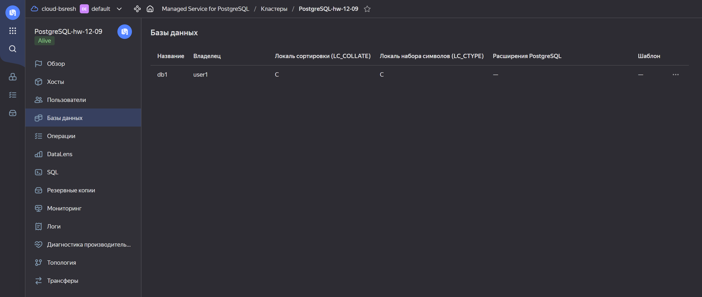

###### Скриншот топологии:
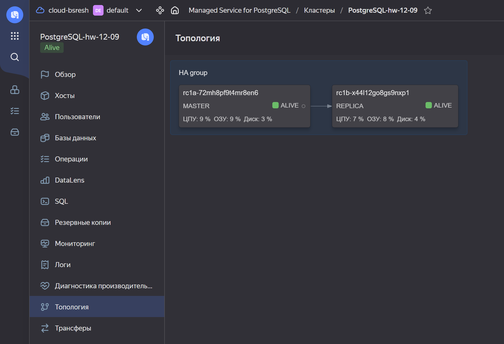

##### 2. Подключение к кластеру PostgreSQL с помощью утилиты psql: 

- Установлен сертификат
```
mkdir -p ~/.postgresql && \
wget "https://storage.yandexcloud.net/cloud-certs/CA.pem" \
    --output-document ~/.postgresql/root.crt && \
chmod 0600 ~/.postgresql/root.crt

```

- Установлены зависимости:
```
sudo apt update && sudo apt install --yes postgresql-client

```

- Выполнено подключение к кластеру с помощью утилиты psql:
```
psql "host=rc1a-72mh8pf9t4mr8en6.mdb.yandexcloud.net,rc1b-x44l12go8gs9nxp1.mdb.yandexcloud.net \
    port=6432 \
    sslmode=verify-full \
    dbname=db1 \
    user=user1 \
    target_session_attrs=read-write"

```

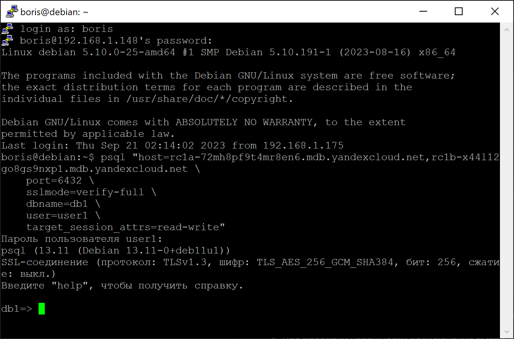


- Для проверки успешности подключения был выполнен запрос:
```
SELECT version();
```
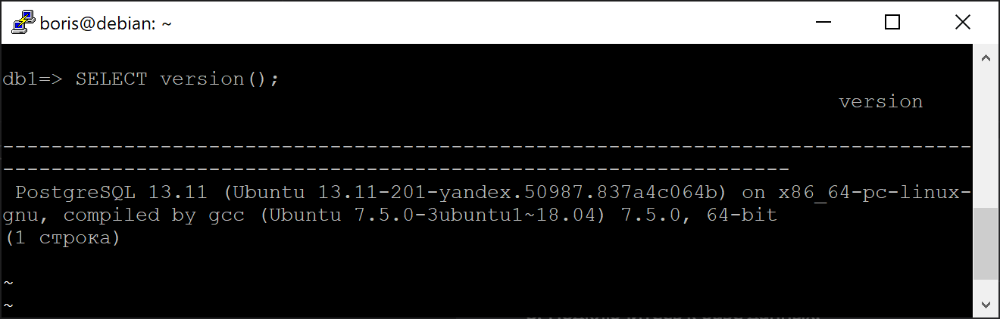

- Проверим, что подключение прошло к master-узлу:

```
select case when pg_is_in_recovery() then 'REPLICA' else 'MASTER' end;
```
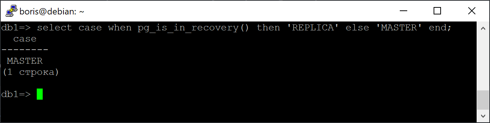

- Посмотрим количество подключённых реплик:
```
select count(*) from pg_stat_replication;
```
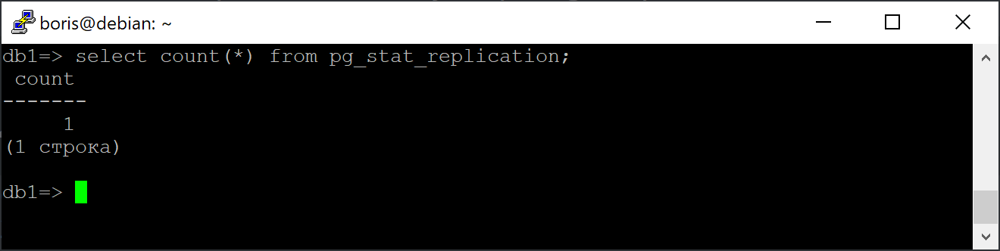

##### 3. Проверка работоспособности репликации в кластере: 

- Была создана таблица, в которую были вставлены 2 строки.

```
CREATE TABLE test_table(text varchar);
insert into test_table values('Строка 1');
insert into test_table values('Строка 2');
```
Для проверки, что таблица создана, выполним команду:
```
select * from test_table;
```

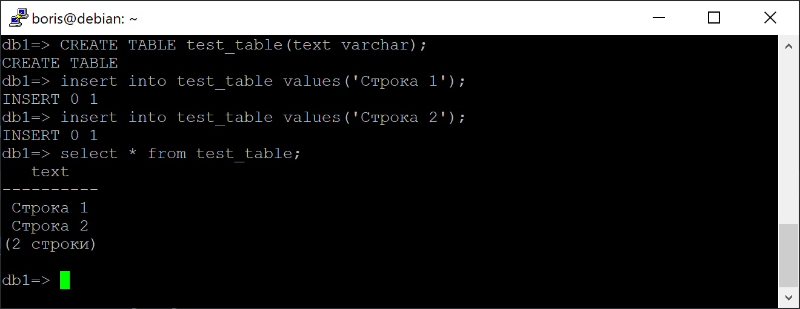

- Подключение к узлу-реплике:

```
psql "host=rc1b-x44l12go8gs9nxp1.mdb.yandexcloud.net \
    port=6432 \
    sslmode=verify-full \
    dbname=db1 \
    user=user1"
```

Проверим, что подключение прошло к узлу-реплике:
```
select case when pg_is_in_recovery() then 'REPLICA' else 'MASTER' end;
```

Далее проверим состояние репликации:
```
select status from pg_stat_wal_receiver;
```

Для проверки, что механизм репликации данных работает между зонами доступности облака, был выполнен запрос к таблице, созданной на предыдущем шаге:

```
select * from test_table;
```

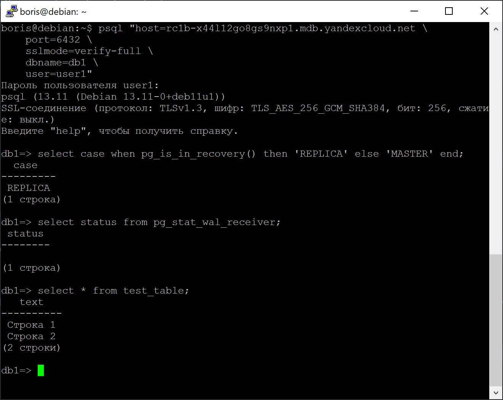