# Домашнее задание к занятию «`Защита хоста`» - `Борис Решетников`

### Задание 1

1. Установите **eCryptfs**.
2. Добавьте пользователя cryptouser.
3. Зашифруйте домашний каталог пользователя с помощью eCryptfs.

*В качестве ответа  пришлите снимки экрана домашнего каталога пользователя с исходными и зашифрованными данными.*  

### Ответ:
Установим eCryptfs
```
boris@bsr:~$ sudo apt install ecryptfs-utils
```
Далее создадим пользователя cryptouser
```
boris@bsr:~$ sudo adduser --encrypt-home cryptouser
```
Далее проверим шифрование. Для этого авторизуемся как пользователь cryptouser и создадим в домашнем каталоге этого пользователя 3 файла test_file1, test_file2, test_file3. Затем выйдем и попытаемся посмотреть содержимое каталога от имени пользователя root. Так как данные зашифрованы, файлы test_file1, test_file2, test_file3 не доступны.

Скриншот домашнего каталога пользователя cryptouser с исходными данными.

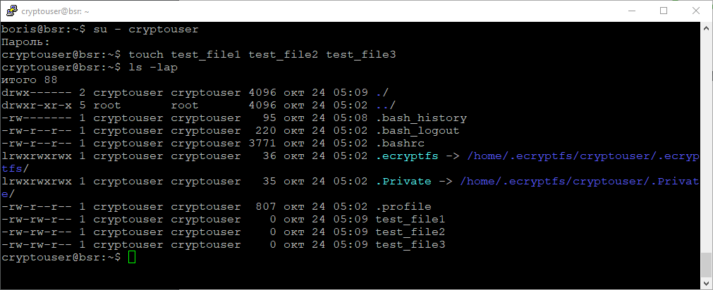

Скриншот домашнего каталога пользователя cryptouser с зашифрованными данными данными.

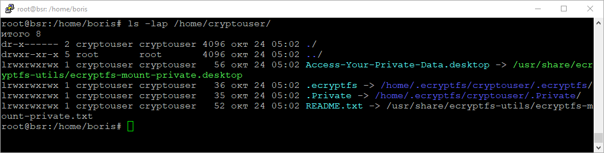

---

### Задание 2

1. Установите поддержку **LUKS**.
2. Создайте небольшой раздел, например, 100 Мб.
3. Зашифруйте созданный раздел с помощью LUKS.

*В качестве ответа пришлите снимки экрана с поэтапным выполнением задания.*

### Ответ:
1. Установлена поддержка **LUKS**

```
boris@bsr:~$ sudo apt-get install cryptsetup
```
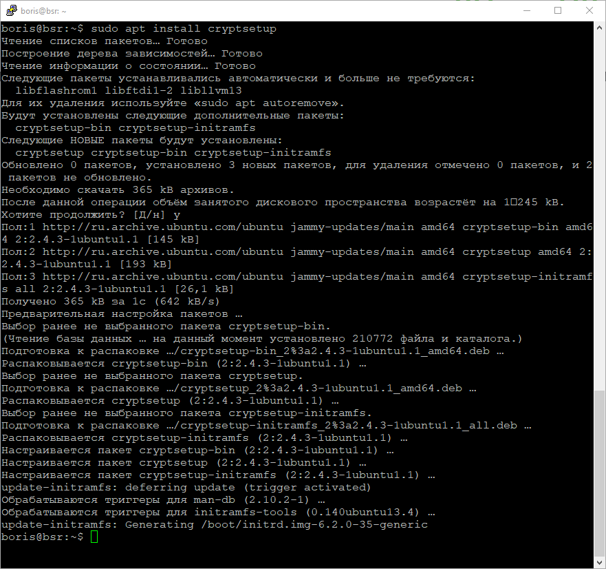

Проверка установки LUKS

```
boris@bsr:~$ cryptsetup --version
```
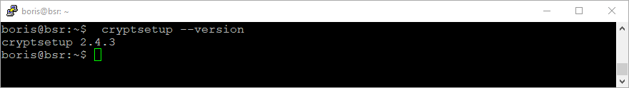

2. Создание раздела размером 100 МиБ

```
sudo fdisk /dev/sdb
```

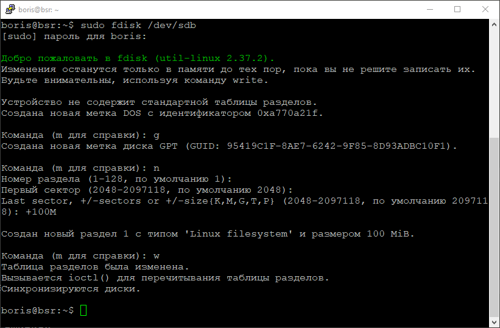

3. Инициализируем шифрованный раздел. На этом этапе создаётся пароль для доступа к шифрованному разделу.

```
boris@bsr:~$ sudo cryptsetup -y -v --type luks2 luksFormat /dev/sdb1
```
Пояснения по опциям.
 -v, --verbose: Показывает детализированные сообщения об ошибках
 -y, --verify-passphrase: Проверяет парольную фразу, запрашивая ее дважды
 --type luks2: Cryptsetup поддерживает различные режимы шифрования для использования с dm-crypt. Здесь используется LUKS2, последняя доступная версия LUKS, позволяющая использовать дополнительные расширения.
 luksFormat device: настройка нового устройства dm-crypt в режиме шифрования LUKS

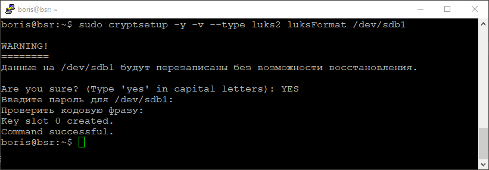

4. Подключаем шифрованный раздел, для его последующего монтирования. Для этого необходимо ввести ранее созданный пароль.

```
boris@bsr:~$ sudo cryptsetup luksOpen /dev/sdb1 disk
boris@bsr:~$ ls -lap /dev/mapper/disk
```
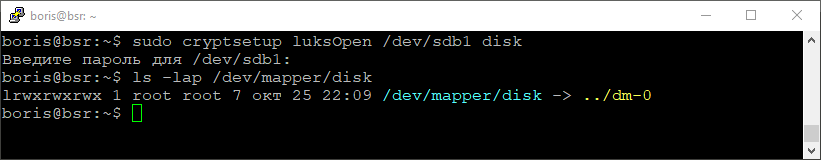

5. Форматирование раздела.

```
boris@bsr:~$ sudo dd if=/dev/zero of=/dev/mapper/disk
boris@bsr:~$ sudo mkfs.ext4 /dev/mapper/disk
```
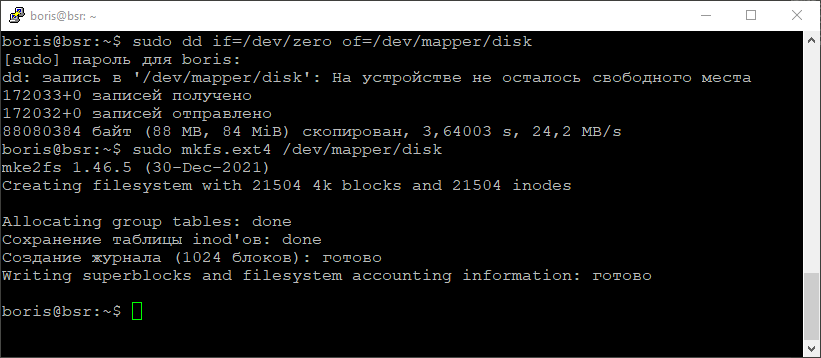

6. Монтирование «открытого» раздела

```
boris@bsr:~$ mkdir .secret
boris@bsr:~$ ls -lap .secret
boris@bsr:~$ sudo mount /dev/mapper/disk .secret/
boris@bsr:~$ ls -lap .secret
```

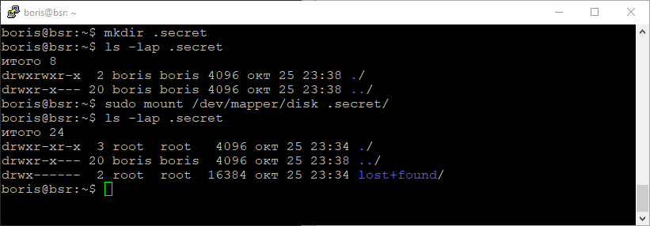

7. Настройка прав доступа

```
boris@bsr:~$ sudo chown boris:boris .secret/
boris@bsr:~$ sudo chmod 700 .secret/
boris@bsr:~$ ls -lap .secret/
```
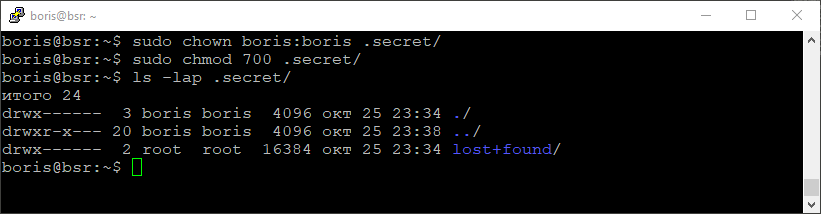

8. Создадим для проверки на зашифрованном разделе несколько файлов. 
```
boris@bsr:~$ cd .secret/
boris@bsr:~/.secret$ ls -lap
boris@bsr:~/.secret$ touch test1 test2 test3 test4 test5
boris@bsr:~/.secret$ ls -lap
```
Затем размонтируем раздел и завершим работу cryptsetup.
```
boris@bsr:~$ sudo umount .secret/
boris@bsr:~$ sudo cryptsetup luksClose disk
boris@bsr:~$ ls -lap .secret/
```
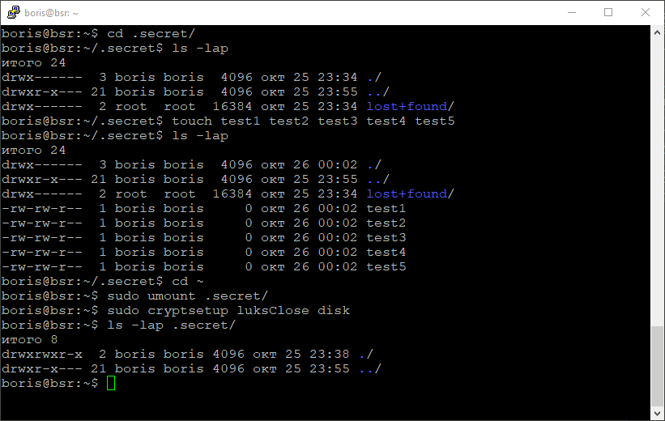

9. Теперь снова выполним монтирование зашифрованного диска, для этого нужно ввести пароль доступа к зашифрованному разделу. И затем проверим наличие ранее созданных файлов.

```
boris@bsr:~$ ls -lap .secret/
boris@bsr:~$ sudo cryptsetup luksOpen /dev/sdb1 disk
boris@bsr:~$ sudo mount /dev/mapper/disk .secret/
boris@bsr:~$ ls -lap .secret/
```

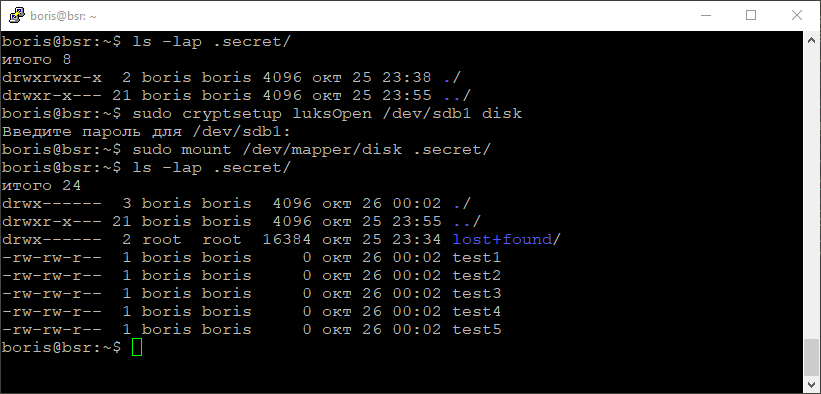


