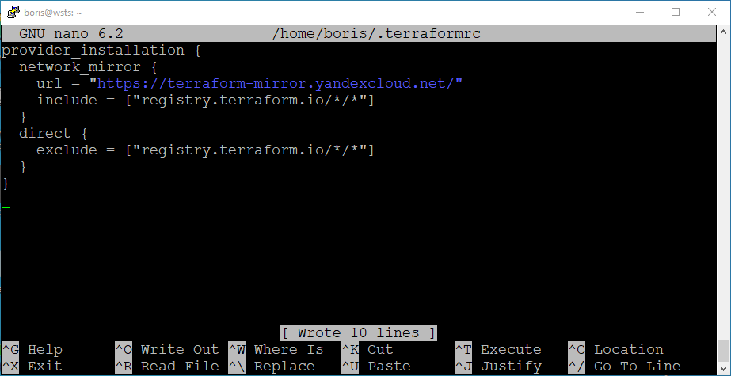

# Домашнее задание к занятию "`Terraform`" - `Решетников Борис`

---

### Задание 1

**Ответьте на вопрос в свободной форме.**

Опишите виды подхода к IaC:

 * функциональный;
 * процедурный;
 * интеллектуальный.

### Ответ:

Функциональный (декларативный) подход. Функциональный подход нацелен на то, чтобы описать, как должна выглядеть целевая конфигурация. При функциональном подходе описывается ожидаемый результат, а не способ его получения. В функциональном подходе нет понятия состояния, в частности, нет переменных и операторов присваивания.

Процедурный (императивный) подход. Процедурный сфокусирован на том, какие внести изменения  для того, чтобы получить целевую инфраструктуру. При процедурном подходе требуется описание последовательности шагов для решения задачи. В исходном коде записываются инструкции (команды); инструкции должны выполняться последовательно; данные, получаемые при выполнении предыдущих инструкций, могут читаться из памяти последующими инструкциями; данные, полученные при выполнении инструкции, могут записываться в память. 

Интеллектуальный подход. При интеллектуальном подходе описывается, почему инфраструктура должна быть так сконфигурирована. 

---

### Задание 2

**Ответьте на вопрос в свободной форме.**

Как вы считаете, в чём преимущество применения Terraform?

### Ответ:

Преимуществом Terraform является супер-портативность, которая заключается в том, что одна утилита и один язык используется для описания облачной инфраструктуры в Google Cloud, AWS, OpenStack, и можно работать с любым поставщиком услуг. Есть возможность без проблем сменить поставщика услуг.

Ещё одним преимуществом Terraform является простота полноценного запуска приложений. Например, на облачных серверах запущены Docker контейнеры под управлением Kubernetes, в которых работают различные приложения. И всем этим можно управлять при помощи одного инструмента. 
 
---

### Задание 3

**Ответьте на вопрос в свободной форме.**

Какие минусы можно выделить при использовании IaC?

### Ответ:

* При разработке IaC может потребоваться использовать дополнительные утилиты.
* Любые ошибки,  возникающие при проектировании, могут быстро распространиться по всем окружениям проекта. Поэтому IaC должен быть всесторонне протестирован.
* Конфигурация окружения может быть изменена администратором без внесения соответствующих изменений в IaC. Чтобы этого избежать необходимо полностью интегрировать IaC в процесс системного администрирования, во все IT и DevOps-процессы. Также необходимо вести документацию.

 
---

### Задание 4

**Выполните действия и приложите скриншоты запуска команд.**

Установите Terraform на компьютерную систему (виртуальную или хостовую), используя лекцию или [инструкцию](https://learn.hashicorp.com/tutorials/terraform/install-cli).    

В связи с недоступностью ресурсов для загрузки Terraform на территории РФ, вы можете  воспользоваться VPN или использовать зеркало YandexCloud.   
- [Документация по провайдерам Terraform в зеркале YandexCloud](https://registry.tfpla.net/browse/providers)   
- [Зеркало YandexCloud для загрузки Terraform](https://hashicorp-releases.yandexcloud.net/terraform/)    
- [Инструкция по настройке провайдера](https://cloud.yandex.ru/docs/tutorials/infrastructure-management/terraform-quickstart#configure-terraform)  

### Ответ:

    get https://hashicorp-releases.yandexcloud.net/terraform/1.4.4/terraform_1.4.4_linux_amd64.zip

    zcat terraform_1.4.4_linux_amd64.zip > terraform
    sudo mv ./terraform /usr/local/bin/
    cd /usr/local/bin/
    ls -lap
    sudo chmod 766 terraform
    ls -lap
    cd ~
    terraform --version

Далее для настройки зеркала в дириктории `~/` создадим файл .terraformrc со следующим содержимым:

      provider_installation {
        network_mirror {
          url = "https://terraform-mirror.yandexcloud.net/"
          include = ["registry.terraform.io/*/*"]
        }
        direct {
          exclude = ["registry.terraform.io/*/*"]
        }
      }

Далее для проверки работы Terraform создадим конфигурационный файл main.tf со следующим содержимым:

      terraform {
        required_providers {
          yandex = {
            source = "yandex-cloud/yandex"
          }
        }
      }

Затем выполним команду

    terraform init

Terraform установлен.

---