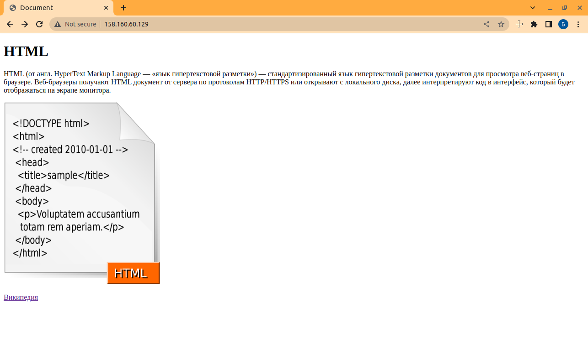

# Домашнее задание к занятию "`Подъём инфраструктуры в Yandex Cloud`" - `Решетников Борис`

---

### Задание 1 

**Выполните действия, приложите скриншот скриптов, скриншот выполненного проекта.**

От заказчика получено задание: при помощи Terraform и Ansible собрать виртуальную инфраструктуру и развернуть на ней веб-ресурс. 

В инфраструктуре нужна одна машина с ПО ОС Linux, двумя ядрами и двумя гигабайтами оперативной памяти. 

Требуется установить nginx, залить при помощи Ansible конфигурационные файлы nginx и веб-ресурса. 

Для выполнения этого задания нужно сгенерировать SSH-ключ командой ssh-kengen. Добавить в конфигурацию Terraform ключ в поле:

```
 metadata = {
    user-data = "${file("./meta.txt")}"
  }
``` 

В файле meta прописать: 
 
```
 users:
  - name: user
    groups: sudo
    shell: /bin/bash
    sudo: ['ALL=(ALL) NOPASSWD:ALL']
    ssh-authorized-keys:
      - ssh-rsa  xxx
```
Где xxx — это ключ из файла /home/"name_ user"/.ssh/id_rsa.pub. Примерная конфигурация Terraform:

```
terraform {
  required_providers {
    yandex = {
      source = "yandex-cloud/yandex"
    }
  }
}

provider "yandex" {
  token     = "xxx"
  cloud_id  = "xxx"
  folder_id = "xxx"
  zone      = "ru-central1-a"
}

resource "yandex_compute_instance" "vm-1" {
  name = "terraform1"

  resources {
    cores  = 2
    memory = 2
  }

  boot_disk {
    initialize_params {
      image_id = "fd87kbts7j40q5b9rpjr"
    }
  }

  network_interface {
    subnet_id = yandex_vpc_subnet.subnet-1.id
    nat       = true
  }
  
  metadata = {
    user-data = "${file("./meta.txt")}"
  }

}
resource "yandex_vpc_network" "network-1" {
  name = "network1"
}

resource "yandex_vpc_subnet" "subnet-1" {
  name           = "subnet1"
  zone           = "ru-central1-b"
  network_id     = yandex_vpc_network.network-1.id
  v4_cidr_blocks = ["192.168.10.0/24"]
}

output "internal_ip_address_vm_1" {
  value = yandex_compute_instance.vm-1.network_interface.0.ip_address
}
output "external_ip_address_vm_1" {
  value = yandex_compute_instance.vm-1.network_interface.0.nat_ip_address
}
```

В конфигурации Ansible указать:

* внешний IP-адрес машины, полученный из output external_ ip_ address_ vm_1, в файле hosts;
* доступ в файле plabook *yml поля hosts.

```
- hosts: 138.68.85.196
  remote_user: user
  tasks:
    - service:
        name: nginx
        state: started
      become: yes
      become_method: sudo
```

Провести тестирование. 

---

### Ответ:

Создадим рабочую директорию hw-terraform. В этой директории создадим:
* основной конфигурационный файл main.tf
* файл с переменными variables.tf В этом файле находится информация, необходимая для подключения к yandex cloud.
* файл meta.yaml В этом файле находится информация, необходимая для подключения  по ssh к создаваемой виртуальной машине.


**main.tf**
```
terraform {
  required_providers {
    yandex = {
      source = "yandex-cloud/yandex"
    }
  }
  required_version = ">= 0.13"

}

provider "yandex" {
  token = var.oauth_token
  cloud_id = var.cloud_id
  folder_id = var.folder_id
  zone = var.region
  
}

resource "yandex_compute_instance" "vm-2" {
  name = "linux-vm2"
  platform_id = "standard-v3"
  allow_stopping_for_update = true

  resources {
    cores  = 2
    memory = 2
  }

  scheduling_policy {
    preemptible = true
  }

  boot_disk {
    initialize_params {
      image_id = "fd8jvr9ans916ofp7gdg"
    }
  }

  network_interface {
    subnet_id = yandex_vpc_subnet.subnet-1.id
    nat       = true
  }
  
  metadata = {
    user-data = file("./meta.yaml")
  }

}
resource "yandex_vpc_network" "network-1" {
  name = "network1"
}

resource "yandex_vpc_subnet" "subnet-1" {
  name           = "subnet1"
  network_id     = yandex_vpc_network.network-1.id
  v4_cidr_blocks = ["192.168.11.0/24"]
}

output "internal_ip_address_vm_2" {
  value = yandex_compute_instance.vm-2.network_interface.0.ip_address
}
output "external_ip_address_vm_2" {
  value = yandex_compute_instance.vm-2.network_interface.0.nat_ip_address
}

```
**variables.tf**

```
variable "region" {
 
 default = "ru-central1-a"
}

variable "folder_id" {
 
 default = "b1gqp14teiv31vnpi7ks"
}

variable "cloud_id" {
 
 default = "b1gvd81kucb0n01i6eop"
}

variable "oauth_token" {
 
 default = "<Oauth token>"
}

```
**meta.yaml**
Cгенерируем пару ключей: публичный id_rsa.pub и приватный id_rsa ключи. Файлы с этими ключами разместим в директории ~/.ssh Публичный ключ внесём в файл meta.yaml. В основном конфигурационном файле main.tf есть ссылка на файл meta.yaml. 

```
#cloud-config
users:
  - name: user
    groups: sudo
    shell: /bin/bash
    sudo: ['ALL=(ALL) NOPASSWD:ALL']
    ssh-authorized-keys:
      - ssh-rsa AAAAB3NzaC1yc2EAAAADAQABAAABgQCPyNo02EVQ4x59YkLdSFjSqpX8aIJTxH1U1QYeWFzIYckoidCsXRWxkUwvOwN1nJIJMhooIf1w9D+886tsdhZGLHkvl/hMCKm00Bnd+xYoKBv1L3Sl3bjwd41VeeYjosjCOavvHtG3Iepv2CbWXUAnYP7rtdA4x1aPDOIWN5+R4m8uPtJw/vW6G+Cg1aECjmIBjwIOlOo/i8469ozX1PiRet+bzXVGOm67kIMKFs2l7VlJ8sS2FMLv3I6Wh+Xu5xzMqT0GOTJTu40pwbYxD6eIjxo6x3rhjuxMcluN23BxDxTDUWzq3uK0ZmRfy759tE+KYrT6wdfoSOBkafXd0grCZ0hfezOY/3zf/RQ+iiNXptrBebFuVGjJNbzNcu8xhJkfHyPp6KhDYMdNs5j7GqqoCyZjCsvNVinhuimq3qulliJ02+RrCoa+g/ePXvnoivcACLHT2t0sIwjmHPA7Y9KzdoQ5stWBrcUMhSx4kD1cnV2hNVPFl+qjucqpDqGOa3s= boris@wsts
```

Далее инициализируем рабочий каталог Terraform

    terraform init


Далее можно выполнить команду terraform plan, чтобы посмотреть будущую конфигурацию создаваемой виртуальной машины.

```
boris@wsts:~/hw-terraform$ terraform plan

Terraform used the selected providers to generate the following execution plan. Resource
actions are indicated with the following symbols:
  + create

Terraform will perform the following actions:

  # yandex_compute_instance.vm-2 will be created
  + resource "yandex_compute_instance" "vm-2" {
      + allow_stopping_for_update = true
      + created_at                = (known after apply)
      + folder_id                 = (known after apply)
      + fqdn                      = (known after apply)
      + gpu_cluster_id            = (known after apply)
      + hostname                  = (known after apply)
      + id                        = (known after apply)
      + metadata                  = {
          + "user-data" = <<-EOT
                #cloud-config
                users:
                  - name: user
                    groups: sudo
                    shell: /bin/bash
                    sudo: ['ALL=(ALL) NOPASSWD:ALL']
                    ssh-authorized-keys:
                      - ssh-rsa AAAAB3NzaC1yc2EAAAADAQABAAABgQCPyNo02EVQ4x59YkLdSFjSqpX8aIJTxH1U1QYeWFzIYckoidCsXRWxkUwvOwN1nJIJMhooIf1w9D+886tsdhZGLHkvl/hMCKm00Bnd+xYoKBv1L3Sl3bjwd41VeeYjosjCOavvHtG3Iepv2CbWXUAnYP7rtdA4x1aPDOIWN5+R4m8uPtJw/vW6G+Cg1aECjmIBjwIOlOo/i8469ozX1PiRet+bzXVGOm67kIMKFs2l7VlJ8sS2FMLv3I6Wh+Xu5xzMqT0GOTJTu40pwbYxD6eIjxo6x3rhjuxMcluN23BxDxTDUWzq3uK0ZmRfy759tE+KYrT6wdfoSOBkafXd0grCZ0hfezOY/3zf/RQ+iiNXptrBebFuVGjJNbzNcu8xhJkfHyPp6KhDYMdNs5j7GqqoCyZjCsvNVinhuimq3qulliJ02+RrCoa+g/ePXvnoivcACLHT2t0sIwjmHPA7Y9KzdoQ5stWBrcUMhSx4kD1cnV2hNVPFl+qjucqpDqGOa3s= boris@wsts
            EOT
        }
      + name                      = "linux-vm2"
      + network_acceleration_type = "standard"
      + platform_id               = "standard-v3"
      + service_account_id        = (known after apply)
      + status                    = (known after apply)
      + zone                      = (known after apply)

      + boot_disk {
          + auto_delete = true
          + device_name = (known after apply)
          + disk_id     = (known after apply)
          + mode        = (known after apply)

          + initialize_params {
              + block_size  = (known after apply)
              + description = (known after apply)
              + image_id    = "fd8jvr9ans916ofp7gdg"
              + name        = (known after apply)
              + size        = (known after apply)
              + snapshot_id = (known after apply)
              + type        = "network-hdd"
            }
        }

      + network_interface {
          + index              = (known after apply)
          + ip_address         = (known after apply)
          + ipv4               = true
          + ipv6               = (known after apply)
          + ipv6_address       = (known after apply)
          + mac_address        = (known after apply)
          + nat                = true
          + nat_ip_address     = (known after apply)
          + nat_ip_version     = (known after apply)
          + security_group_ids = (known after apply)
          + subnet_id          = (known after apply)
        }

      + resources {
          + core_fraction = 100
          + cores         = 2
          + memory        = 2
        }

      + scheduling_policy {
          + preemptible = true
        }
    }

  # yandex_vpc_network.network-1 will be created
  + resource "yandex_vpc_network" "network-1" {
      + created_at                = (known after apply)
      + default_security_group_id = (known after apply)
      + folder_id                 = (known after apply)
      + id                        = (known after apply)
      + labels                    = (known after apply)
      + name                      = "network1"
      + subnet_ids                = (known after apply)
    }

  # yandex_vpc_subnet.subnet-1 will be created
  + resource "yandex_vpc_subnet" "subnet-1" {
      + created_at     = (known after apply)
      + folder_id      = (known after apply)
      + id             = (known after apply)
      + labels         = (known after apply)
      + name           = "subnet1"
      + network_id     = (known after apply)
      + v4_cidr_blocks = [
          + "192.168.11.0/24",
        ]
      + v6_cidr_blocks = (known after apply)
      + zone           = (known after apply)
    }

Plan: 3 to add, 0 to change, 0 to destroy.

Changes to Outputs:
  + external_ip_address_vm_2 = (known after apply)
  + internal_ip_address_vm_2 = (known after apply)

───────────────────────────────────────────────────────────────────────────────────────────

Note: You didn't use the -out option to save this plan, so Terraform can't guarantee to
take exactly these actions if you run "terraform apply" now.

```

Далее, выполнив команду terraform apply, создадим виртуальную машину.


Далее, выполнив команду terraform show, можно посмотреть конфигурацию созданной виртуальной машины.

```
boris@wsts:~/hw-terraform$ terraform show
# yandex_compute_instance.vm-2:
resource "yandex_compute_instance" "vm-2" {
    allow_stopping_for_update = true
    created_at                = "2023-04-17T16:14:42Z"
    folder_id                 = "b1gqp14teiv31vnpi7ks"
    fqdn                      = "fhmoen1ft854n1s227ue.auto.internal"
    id                        = "fhmoen1ft854n1s227ue"
    metadata                  = {
        "user-data" = <<-EOT
            #cloud-config
            users:
              - name: user
                groups: sudo
                shell: /bin/bash
                sudo: ['ALL=(ALL) NOPASSWD:ALL']
                ssh-authorized-keys:
                  - ssh-rsa AAAAB3NzaC1yc2EAAAADAQABAAABgQCPyNo02EVQ4x59YkLdSFjSqpX8aIJTxH1U1QYeWFzIYckoidCsXRWxkUwvOwN1nJIJMhooIf1w9D+886tsdhZGLHkvl/hMCKm00Bnd+xYoKBv1L3Sl3bjwd41VeeYjosjCOavvHtG3Iepv2CbWXUAnYP7rtdA4x1aPDOIWN5+R4m8uPtJw/vW6G+Cg1aECjmIBjwIOlOo/i8469ozX1PiRet+bzXVGOm67kIMKFs2l7VlJ8sS2FMLv3I6Wh+Xu5xzMqT0GOTJTu40pwbYxD6eIjxo6x3rhjuxMcluN23BxDxTDUWzq3uK0ZmRfy759tE+KYrT6wdfoSOBkafXd0grCZ0hfezOY/3zf/RQ+iiNXptrBebFuVGjJNbzNcu8xhJkfHyPp6KhDYMdNs5j7GqqoCyZjCsvNVinhuimq3qulliJ02+RrCoa+g/ePXvnoivcACLHT2t0sIwjmHPA7Y9KzdoQ5stWBrcUMhSx4kD1cnV2hNVPFl+qjucqpDqGOa3s= boris@wsts
        EOT
    }
    name                      = "linux-vm2"
    network_acceleration_type = "standard"
    platform_id               = "standard-v3"
    status                    = "running"
    zone                      = "ru-central1-a"

    boot_disk {
        auto_delete = true
        device_name = "fhmd0c0evlqbirc1cdjl"
        disk_id     = "fhmd0c0evlqbirc1cdjl"
        mode        = "READ_WRITE"

        initialize_params {
            block_size = 4096
            image_id   = "fd8jvr9ans916ofp7gdg"
            size       = 3
            type       = "network-hdd"
        }
    }

    metadata_options {
        aws_v1_http_endpoint = 1
        aws_v1_http_token    = 2
        gce_http_endpoint    = 1
        gce_http_token       = 1
    }

    network_interface {
        index              = 0
        ip_address         = "192.168.11.4"
        ipv4               = true
        ipv6               = false
        mac_address        = "d0:0d:18:75:c2:fe"
        nat                = true
        nat_ip_address     = "158.160.60.129"
        nat_ip_version     = "IPV4"
        security_group_ids = []
        subnet_id          = "e9b330sd95ege0hj05au"
    }

    placement_policy {
        host_affinity_rules = []
    }

    resources {
        core_fraction = 100
        cores         = 2
        gpus          = 0
        memory        = 2
    }

    scheduling_policy {
        preemptible = false
    }
}

# yandex_vpc_network.network-1:
resource "yandex_vpc_network" "network-1" {
    created_at = "2023-04-17T16:14:39Z"
    folder_id  = "b1gqp14teiv31vnpi7ks"
    id         = "enpbm75uch20t19qi872"
    labels     = {}
    name       = "network1"
    subnet_ids = []
}

# yandex_vpc_subnet.subnet-1:
resource "yandex_vpc_subnet" "subnet-1" {
    created_at     = "2023-04-17T16:14:40Z"
    folder_id      = "b1gqp14teiv31vnpi7ks"
    id             = "e9b330sd95ege0hj05au"
    labels         = {}
    name           = "subnet1"
    network_id     = "enpbm75uch20t19qi872"
    v4_cidr_blocks = [
        "192.168.11.0/24",
    ]
    v6_cidr_blocks = []
    zone           = "ru-central1-a"
}


Outputs:

external_ip_address_vm_2 = "158.160.60.129"
internal_ip_address_vm_2 = "192.168.11.4"
```
**Настройка  Ansible**

**ansible.cfg**
```
[defaults]
inventory = hosts.ini
forks = 5
gathering = explicit

[privilege_escalation]
become = True
become_user = root
become_method = sudo
```
```
***hosts.ini***
[webservers:children]
net1
[net1]
158.160.60.129 ansible_ssh_user=user
```
Выполним пинг до виртуальной машины


**Установка Nginx**

**playbook.yml**
```
- name: "Install packages"
  hosts: webservers
  remote_user: user
  gather_facts: true
  become: yes

  tasks:
  - name: "Ensure that nginx is installed"
    apt:
      name:
        - nginx
      state: latest
  - name: "Start nginx"
    service:
      name: nginx
      state: started
      enabled: yes
```


**Копирование файлов сайта на сервер**

**playbook2.yml**

```
- hosts: net1
  tasks:
    - name: Copy site files.
      copy:
        src: ~/hw-terraform/site/
        dest: /var/www/html/
```



