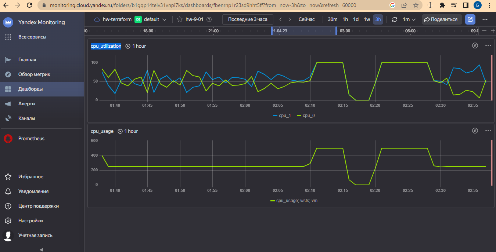
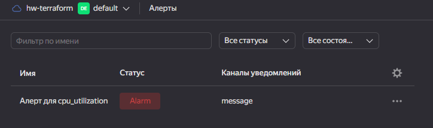
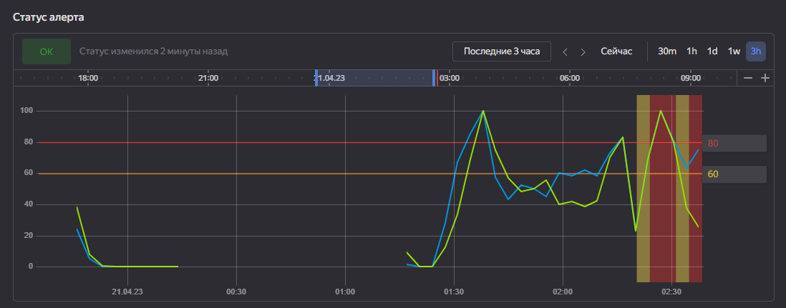
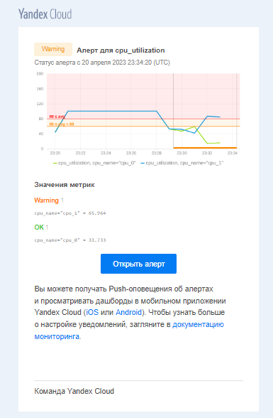
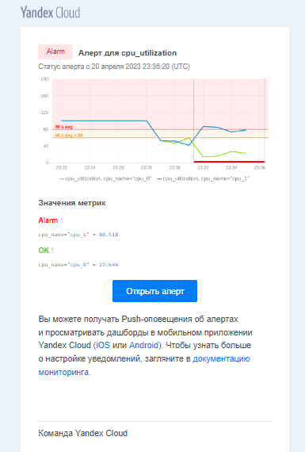

# Домашнее задание к занятию «`Обзор систем IT-мониторинга`» - `Борис Решетников`
---
 
### Задание 1

Создайте виртуальную машину в Yandex Cloud Compute Cloud и с помощью Yandex Monitoring создайте дашборд, на котором будет видно загрузку процессора.

#### Требования к результату
* прикрепите в файл README.md скриншот вашего дашборда в Yandex Monitoring с мониторингом загрузки процессора виртуальной машины   

---

### Ответ:

cpu_utilization - Утилизация процессорных ядер ВМ (vCPU) в процентах. Принимает значения от 0% до уровня производительности vCPU.

cpu_usage - утилизация процессора ВМ в процентах. Значение может превысить 100%, если ВМ потребляет свободные ресурсы процесса сверх гарантированных.

---

### Задание 2 со звёздочкой*
*Это дополнительное задание. Его можно не выполнять. Это не повлияет на зачёт. Вы можете его выполнить, если хотите глубже разобраться в материале.*

С помощью Yandex Monitoring сделайте 2 алерта на загрузку процессора: WARN и ALARM. Создайте уведомление по e-mail.

#### Требования к результату
* прикрепите в файл README.md скриншот уведомления в Yandex Monitoring 

### Ответ:

**Статус в Yandex Monitoring**

**уведомления в Yandex Monitoring**

**Уведомление по электронной почте:**

**Уведомление по электронной почте:**

