# Домашнее задание к занятию «`Система мониторинга Zabbix`» - `Борис Решетников`
---

### Задание 1 

Установите Zabbix Server с веб-интерфейсом.

#### Процесс выполнения
1. Выполняя ДЗ сверяйтесь с процессом отражённым в записи лекции.
2. Установите PostgreSQL. Для установки достаточна та версия что есть в системном репозитороии Debian 11
3. Пользуясь конфигуратором комманд с официального сайта, составьте набор команд для установки последней версии Zabbix с поддержкой PostgreSQL и Apache
4. Выполните все необходимые команды для установки Zabbix Server и Zabbix Web Server

#### Требования к результаты 
1. Прикрепите в файл README.md скриншот авторизации в админке
2. Приложите в файл README.md текст использованных команд в GitHub


### Ответ:
Обновляем списки пакетов, затем обновляем пакеты программного обеспечения до последних версий.
```
sudo apt update
sudo apt upgrade
```

Устанавливаем Postgresql
```
sudo apt install postgresql
```
Добавляем репозиторий Zabbix:
```
wget https://repo.zabbix.com/zabbix/6.4/debian/pool/main/z/zabbix-release/zabbix-release_6.4-1+debian11_all.deb
sudo dpkg -i zabbix-release_6.4-1+debian11_all.deb
sudo apt update
```
Устанавливаем Zabbix сервер и веб-интерфейс.
```
apt install zabbix-server-pgsql zabbix-frontend-php php7.4-pgsql zabbix-apache-conf zabbix-sql-scripts
```
Создаём пользователя базы данных:
```
sudo -u postgres createuser --pwprompt zabbix
```
Создаём базу данных:
```
sudo -u postgres createdb -O zabbix zabbix
```
На хосте Zabbix сервера импортируем начальную схему и данные.
```
zcat /usr/share/zabbix-sql-scripts/postgresql/server.sql.gz | sudo -u zabbix psql zabbix
```
Настраиваем пароль DBPassword в файле /etc/zabbix/zabbix_server.conf.
```
DBPassword=password
```
Запускаем Zabbix Server и web-сервер
```
sudo systemctl restart zabbix-server apache2
sudo systemctl enable zabbix-server apache2
```
Далее настраиваем подключение web-интерфейса к PostgreSQL. Web-интерфейс доступен по ссылке http://<ip_сервера>/zabbix

Выбираем язык:
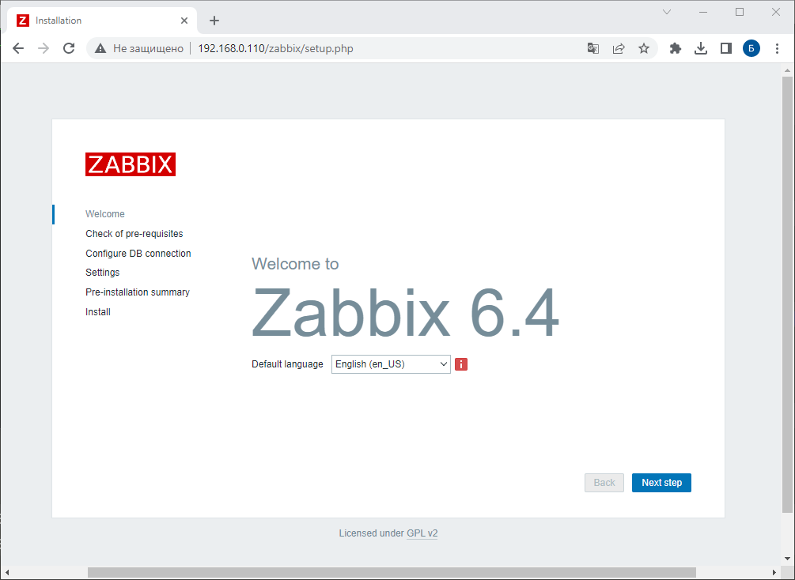

Проверяем, что все предварительные условия соблюдены.
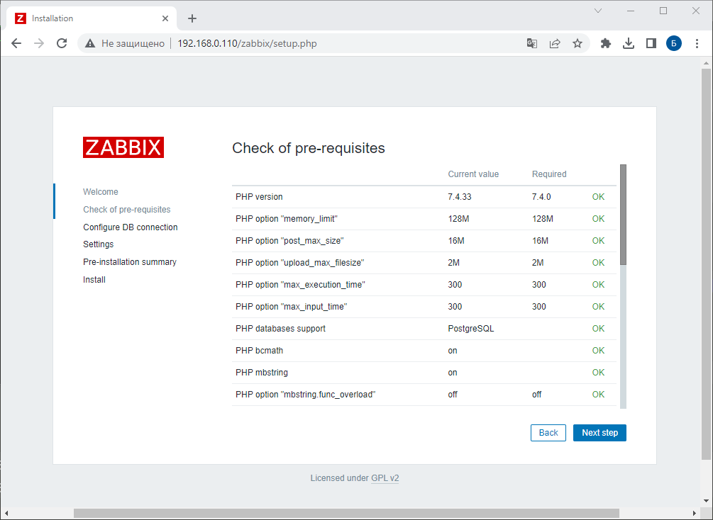

Указываем пароль от пользователя zabbix в PostgreSQL
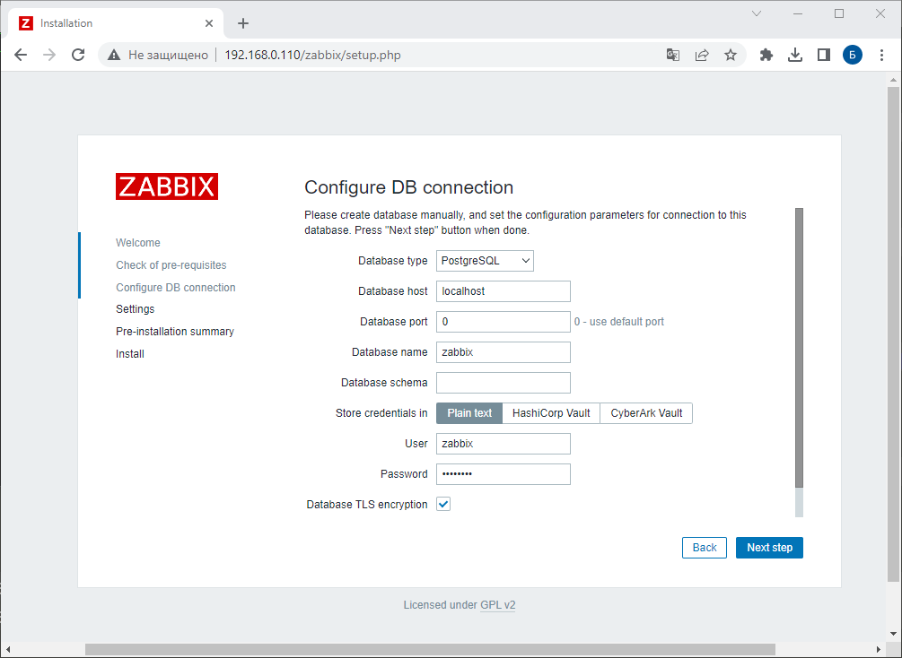

Задаём имя сервера, часовой пояс и цветовую схему.
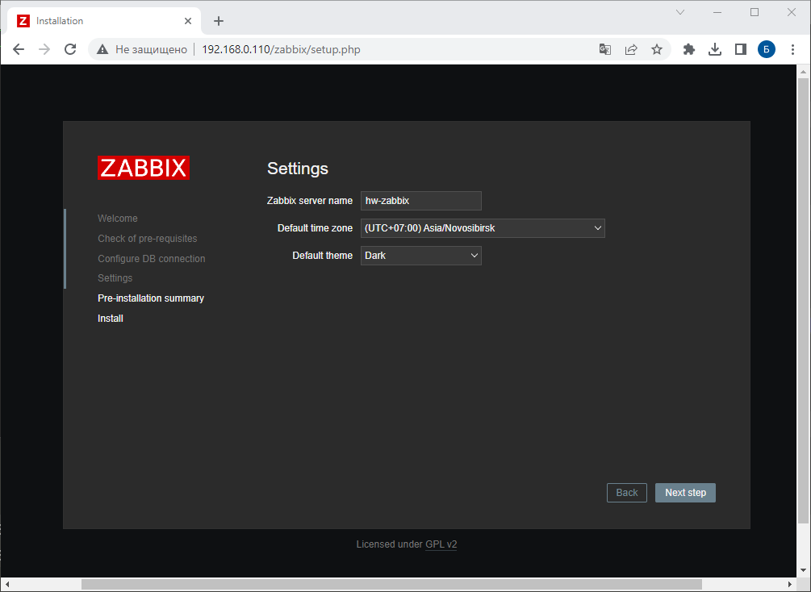

Проверяем суммарные данные:
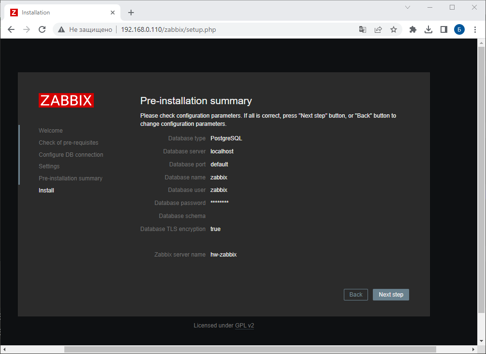

Установка завершена успешно.
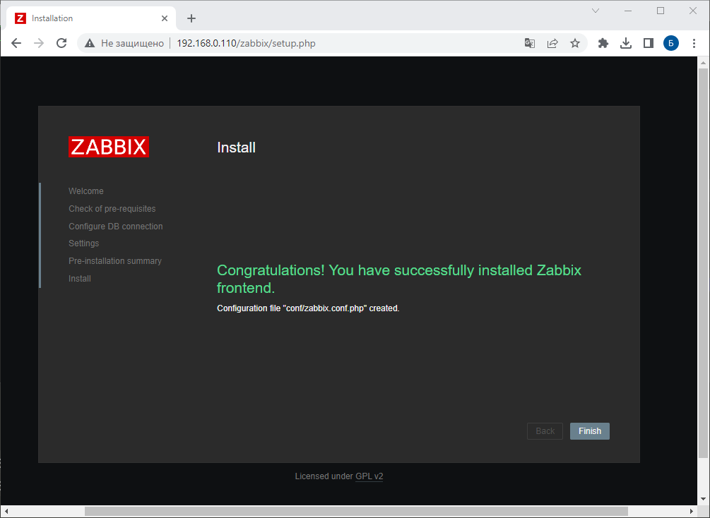

Вводим логин и пароль для входа в админ панель. Логин: Admin. Пароль: zabbix
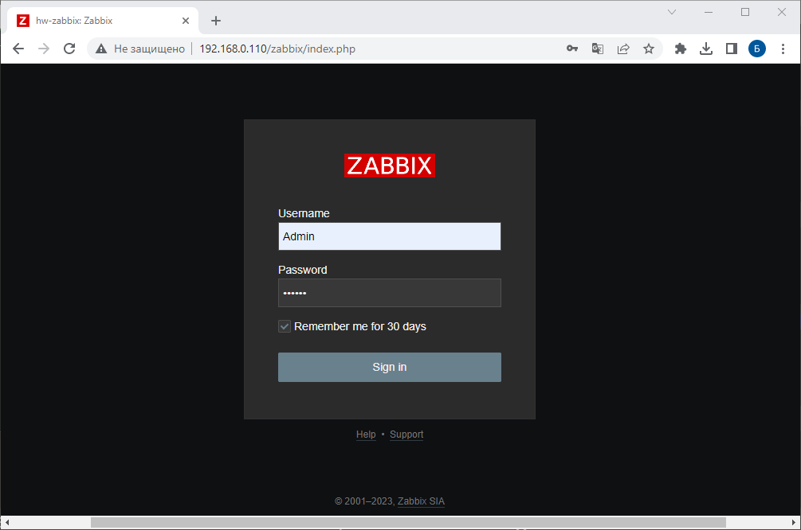

Далее входим в админ-панель.
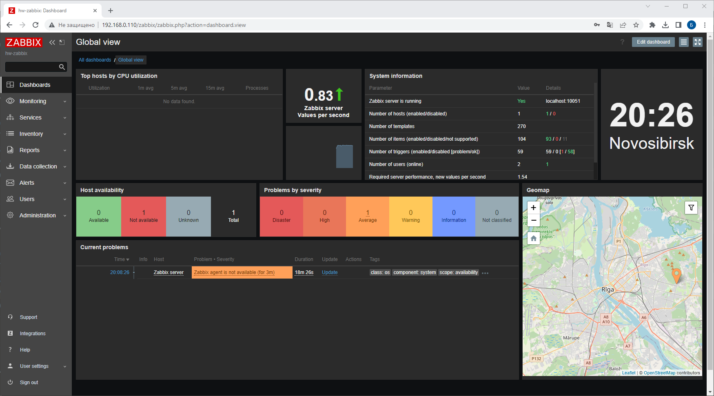


---
### Задание 2 

Установите Zabbix Agent на два хоста.

#### Процесс выполнения
1. Выполняя ДЗ сверяйтесь с процессом отражённым в записи лекции.
2. Установите Zabbix Agent на 2 виртмашины, одной из них может быть ваш Zabbix Server
3. Добавьте Zabbix Server в список разрешенных серверов ваших Zabbix Agentов
4. Добавьте Zabbix Agentов в раздел Configuration > Hosts вашего Zabbix Servera
5. Проверьте что в разделе Latest Data начали появляться данные с добавленных агентов

#### Требования к результаты 
1. Приложите в файл README.md скриншот раздела Configuration > Hosts, где видно, что агенты подключены к серверу
2. Приложите в файл README.md скриншот лога zabbix agent, где видно, что он работает с сервером
3. Приложите в файл README.md скриншот раздела Monitoring > Latest data для обоих хостов, где видны поступающие от агентов данные.
4. Приложите в файл README.md текст использованных команд в GitHub

### Ответ:
Устанавливаем Zabbix Agent на первую виртуальную машину, на которой уже установлен Zabbix Server:
```
sudo apt install zabbix-agent
```
Запускаем Zabbix-agent:
```
sudo systemctl restart zabbix-agent
sudo systemctl enable zabbix-agent
```
Также устанавливаем zabbix-agent на вторую виртуальную машину:
```
wget https://repo.zabbix.com/zabbix/6.4/debian/pool/main/z/zabbix-release/zabbix-release_6.4-1+debian11_all.deb
sudo dpkg -i zabbix-release_6.4-1+debian11_all.deb
sudo apt update
sudo apt install zabbix-agent
sudo systemctl restart zabbix-agent
sudo systemctl enable zabbix-agent
```
На второй виртуальной машине в конфигурационном файле /etc/zabbix/zabbix_agentd.conf в разделе Server добавим адрес zabbix-сервера, с которого zabbix-agent будет принимать подключения:
```
sudo nano /etc/zabbix/zabbix_agentd.conf
```

```
Server=192.168.0.110
```
Далее перезапускаем zabbix-agent:
```
sudo systemctl restart zabbix-agent
```
Далее добавляем Zabbix agent в web-интерфейсе. 

На скриншоте ниже видно, что агенты подключены к серверу.

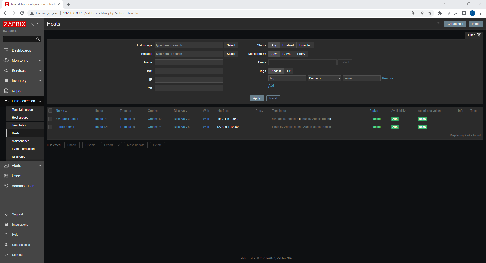

Cкриншот лога zabbix agent для хоста Zabbix server:
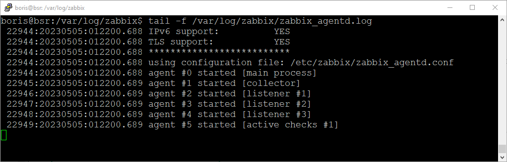

Cкриншот лога zabbix agent для хоста hw-zabbix-agent:
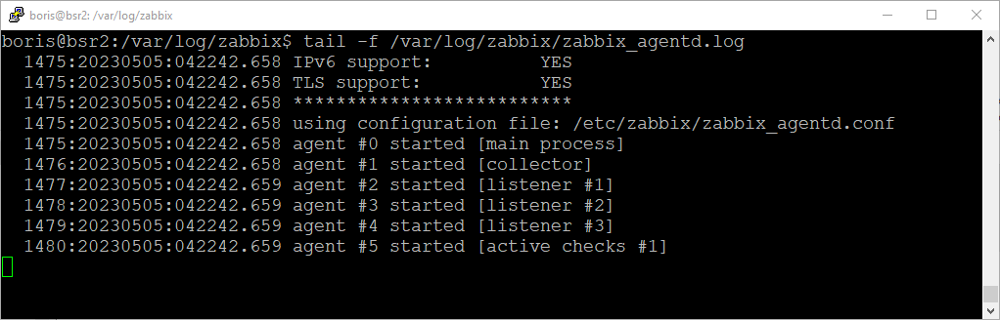

Cкриншот раздела Monitoring > Latest data для хоста Zabbix server
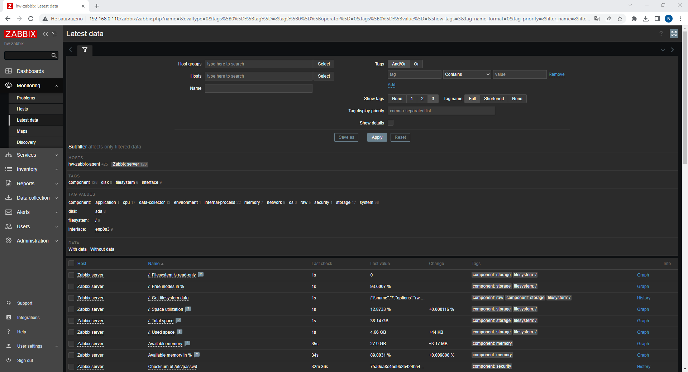

Cкриншот раздела Monitoring > Latest data для хоста hw-zabbix-agent
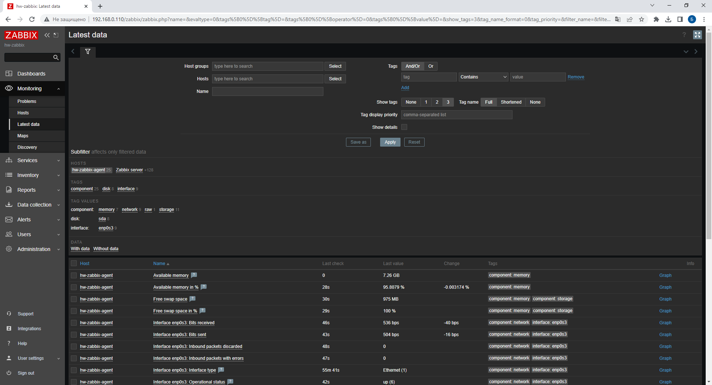
