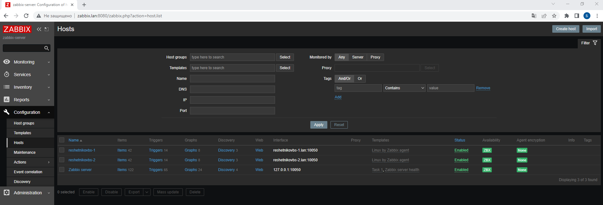
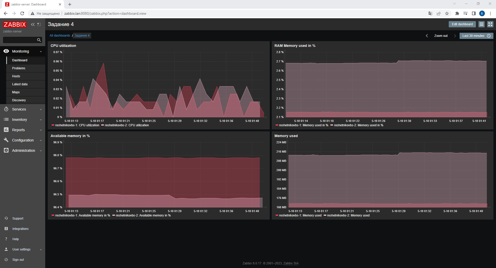

# Домашнее задание к занятию «`Система мониторинга Zabbix. Часть 2`» - `Борис Решетников`
---

### Задание 1 
Создайте свой шаблон, в котором будут элементы данных, мониторящие загрузку CPU и RAM хоста.

#### Процесс выполнения
1. Выполняя ДЗ сверяйтесь с процессом отражённым в записи лекции.
2. В веб-интерфейсе Zabbix Servera в разделе Templates создайте новый шаблон
3. Создайте Item который будет собирать информацию об загрузке CPU в процентах
4. Создайте Item который будет собирать информацию об загрузке RAM в процентах

#### Требования к результату
- [ ] Прикрепите в файл README.md скриншот страницы шаблона с названием «Задание 1»

### Ответ:
Создаём новый шаблон с именем Task 1, в котором будут элементы данных, мониторящие загрузку CPU и RAM хоста

Создаём новые макросы.

Создаём новые теги для шаблона

Далее создаём новый Item с именем CPU utilization, который будет  собирать информацию об загрузке CPU в процентах.

Создаём tag для  Item "CPU utilization"

Далее создаём новый Item с именем RAM used memory, который будет  собирать информацию об загрузке RAM в процентах.

Создаём tag для  Item "RAM used memory"

Список всех элементов данных (Items) для шаблона "Task 1"

Шаблон "Task 1" в списке шаблонов

---
### Задание 2 
Добавьте в Zabbix два хоста и задайте им имена <фамилия и инициалы-1> и <фамилия и инициалы-2>. Например: ivanovii-1 и ivanovii-2.

#### Процесс выполнения
1. Выполняя ДЗ сверяйтесь с процессом отражённым в записи лекции.
2. Установите Zabbix Agent на 2 виртмашины, одной из них может быть ваш Zabbix Server
3. Добавьте Zabbix Server в список разрешенных серверов ваших Zabbix Agentов
4. Добавьте Zabbix Agentов в раздел Configuration > Hosts вашего Zabbix Servera
5. Прикрепите за каждым хостом шаблон Linux by Zabbix Agent
6. Проверьте что в разделе Latest Data начали появляться данные с добавленных агентов

#### Требования к результату
- [ ] Результат данного задания сдавайте вместе с заданием 3

### Ответ:

Список хостов:

Данные в разделе Latest Data:

---
### Задание 3
Привяжите созданный шаблон к двум хостам. Также привяжите к обоим хостам шаблон Linux by Zabbix Agent.

#### Процесс выполнения
1. Выполняя ДЗ сверяйтесь с процессом отражённым в записи лекции.
2. Зайдите в настройки каждого хоста и в разделе Templates прикрепите к этому хосту ваш шаблон
3. Так же к каждому хосту привяжите шаблон Linux by Zabbix Agent
4. Проверьте что в раздел Latest Data начали поступать необходимые данные из вашего шаблона

#### Требования к результату
- [ ] Прикрепите в файл README.md скриншот страницы хостов, где будут видны привязки шаблонов с названиями «Задание 2-3». Хосты должны иметь зелёный статус подключения

### Ответ:

Создаём новый шаблон с именем "Task 2-3", с элементами данных (items): CPU load, Memory active, Memory used, Memory used in %:d

Далее к хостам reshetnikovbs-1 и  reshetnikovbs-2 привязываем шаблоны "Task 2-3" и "Linux by Zabbix Agent"

Ниже представлен скриншот страницы хостов, где видны привязки шаблонов.

Далее проверяем, что в раздел Latest Data начали поступать необходимые данные из шаблонов.

---
### Задание 4
Создайте свой кастомный дашборд.

#### Процесс выполнения
1. Выполняя ДЗ сверяйтесь с процессом отражённым в записи лекции.
2. В разделе Dashboards создайте новый дашборд
3. Разместите на нём несколько графиков на ваше усмотрение.

#### Требования к результату
- [ ] Прикрепите в файл README.md скриншот дашборда с названием «Задание 4»

### Ответ:

