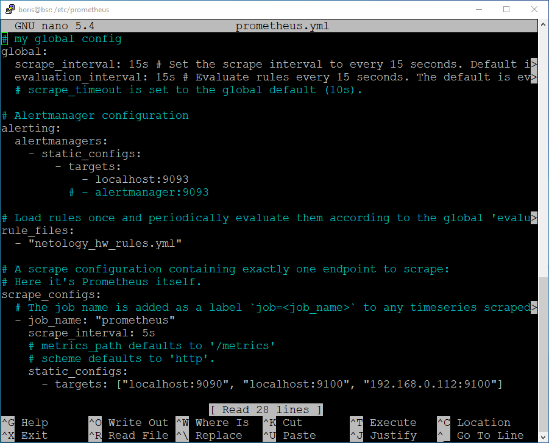
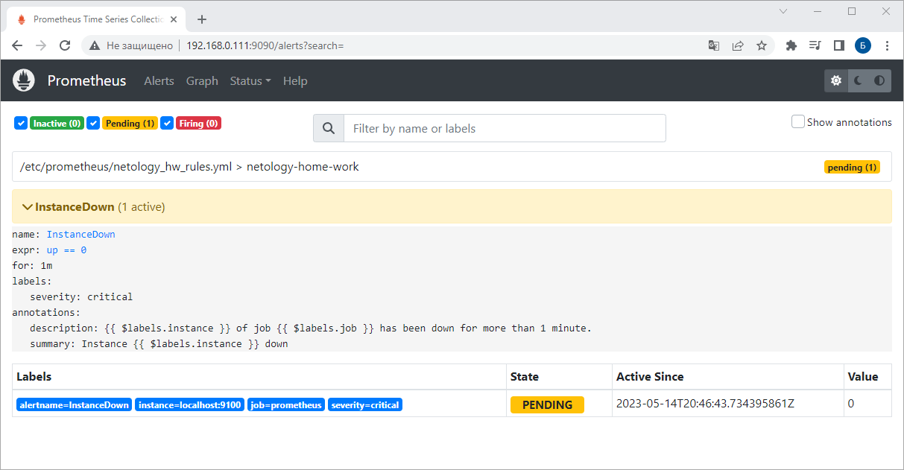
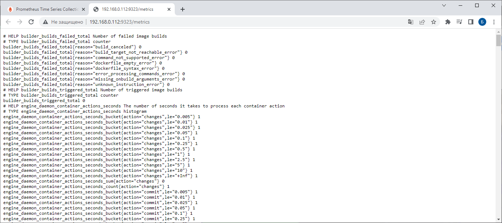

# Домашнее задание к занятию «`Система мониторинга Prometheus. Часть 2`» - `Борис Решетников`

### Задание 1
Создайте файл с правилом оповещения, как в лекции, и добавьте его в конфиг Prometheus.

### Требования к результату
- [ ] Погасите node exporter, стоящий на мониторинге, и прикрепите скриншот раздела оповещений Prometheus, где оповещение будет в статусе Pending

### Ответ:

Создаём файл с правилом оповещения:


Затем добавляем его в конфигурационный файл prometheus.yml в разделе rule_files:



Затем перезапускаем Prometheus
```
sudo systemctl restart prometheus
systemctl status prometheus
```
Теперь погасим node exporter, стоящий на мониторинге:
```
sudo systemctl stop node-exporter
systemctl status node-exporter
```
Далее проверяем оповещение в Prometheus в разделе Alerts



---

### Задание 2
Установите Alertmanager и интегрируйте его с Prometheus.

### Требования к результату
- [ ] Прикрепите скриншот Alerts из Prometheus, где правило оповещения будет в статусе Fireing, и скриншот из Alertmanager, где будет видно действующее правило оповещения

### Ответ:


---

### Задание 3

Активируйте экспортёр метрик в Docker и подключите его к Prometheus.

### Требования к результату
- [ ] приложите скриншот браузера с открытым эндпоинтом, а также скриншот списка таргетов из интерфейса Prometheus.*

### Ответ:



